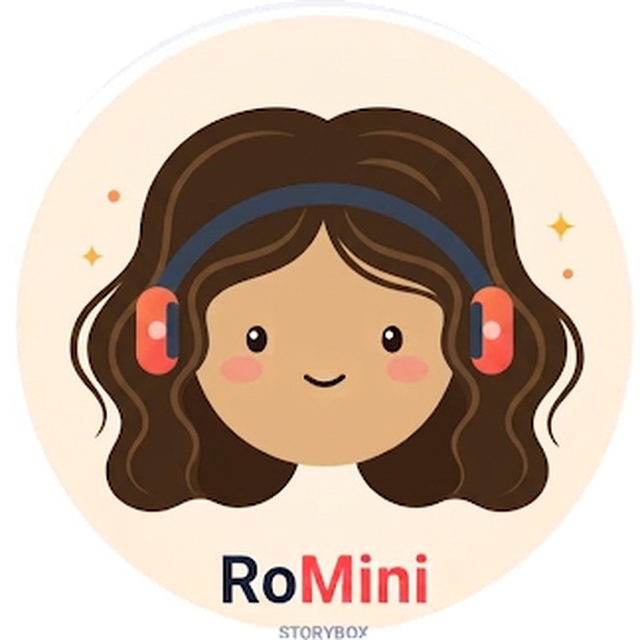
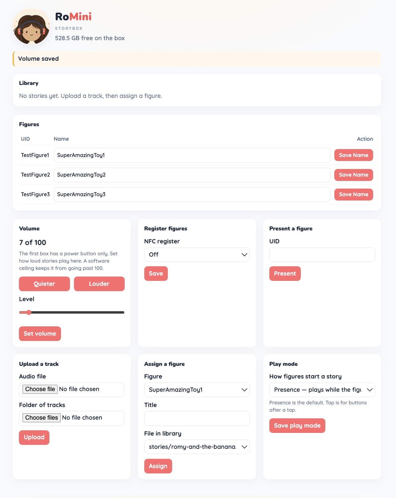

<p align="center">
  
</p>

# RoMini

[](https://github.com/mzworthington/RoMini/actions/workflows/ci.yml)
[](https://sonarcloud.io/summary/new_code?id=mzworthington_RoMini)

Screen-free NFC audio player for a Raspberry Pi. Figures start Tracks; the parent maps Tags on the house LAN.

```bash
./bin/bootstrap
make test
./bin/sim
```

**Run it:** [docs/guide.md](docs/guide.md) — laptop `sim` (`./bin/sim`), emulation limits and Pi bring-up.

## Parent dashboard

`./bin/sim` serves the catalog at `http://127.0.0.1:8080`. On the box, Avahi is `http://<hostname>.local` (usually `http://romini.local`).

<p align="center">
  
</p>

| Doc | Role |
|-----|------|
| [docs/guide.md](docs/guide.md) | Step-by-step laptop + Pi |
| [docs/PRD_001.md](docs/PRD_001.md) | Product requirements |
| [docs/spec.md](docs/spec.md) | Gherkin, glossary |
| [docs/architecture.md](docs/architecture.md) | Hexagon, OTA, overlay |
| [docs/hardware.md](docs/hardware.md) | BOM and GPIO |
| [docs/ADRs/README.md](docs/ADRs/README.md) | Hard-to-reverse choices |
