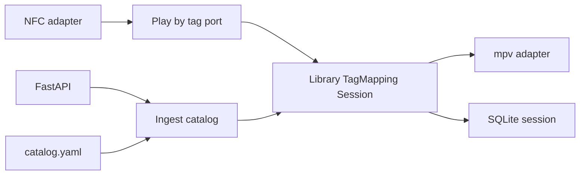

# 0001. Python hexagonal daemon on the Pi

## Context and Problem Statement

The PRD allows Python 3.11+ or Node.js for `romini-core`. The box must drive NFC, GPIO, ALSA/mpv, and a local parent HTTP UI. We need one runtime so GPIO/NFC adapters, tests, and OTA packaging stay a single pipeline.

## Decision Drivers

* Match gpio-build-monitor’s Pi operational model (venv, systemd, wheel).
* Hexagonal ports: domain free of mpv, SPI, and FastAPI ([CODING_PHILOSOPHY](https://github.com/mzworthington/waykit) §1).
* Kit default for this hardware class is typed Python (`lang-python`).

## Considered Options

* Option A: Python 3.11+ daemon, FastAPI as a thin driving adapter, mpv/GPIO/NFC as driven adapters, pytest with fakes.
* Option B: Node.js daemon (PRD alternative) with a separate Python helper for GPIO.
* Option C: Split playback (Python) and dashboard (Node) as two products.

## Decision Outcome

Chosen option: "**Option A**", because one venv/wheel/systemd story matches gpio, NFC/GPIO/mpv bindings are mature in Python, and a second runtime would split OTA and OverlayFS layout for no domain benefit.

### Consequences

* Good, because domain slices can be TDD’d on a laptop with mocked ports (gpio `Mock.GPIO` pattern).
* Good, because FastAPI stays at the HTTP edge; play/pause rules do not live in route handlers.
* Bad, because the parent UI is not a React SPA unless we add a static adapter later; v1 can be server-rendered or a small static bundle served by FastAPI.
* Follow-up: pin mpv IPC and NFC libraries in adapters only.

## Architecture sketch

## Links

* Related ADRs: [0002](./0002-github-release-wheel-ota.md), [0003](./0003-overlayfs-writable-library.md), [0007](./0007-yaml-catalog-sqlite-session.md)
* Spec / issue: [PRD_001.md](../PRD_001.md)
* Arch norms: hexagonal, DDD, vertical slices
