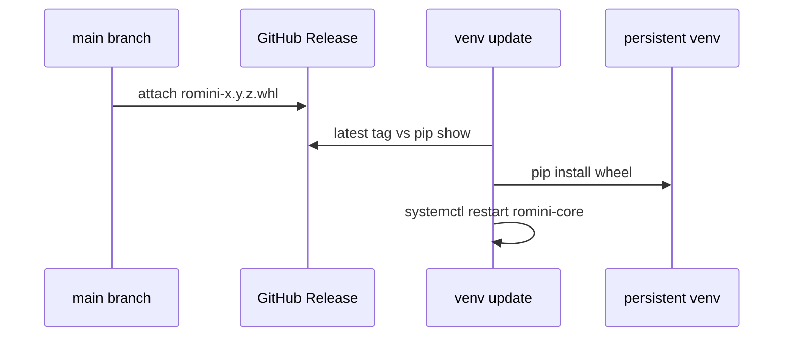

# 0002. Over-the-wire updates from GitHub Release wheels

## Context and Problem Statement

The device must receive new software without SSH or a screen. A git checkout on the Pi is tempting but fights OverlayFS, mixed local library files, and dirty working trees. gpio-build-monitor already solved “Pi follows GitHub” by installing a release **wheel**, not by pulling `main`.

## Decision Drivers

* Operability: unattended update, restart the player service only.
* Reversibility: pin to a previous release wheel if a build is bad.
* Do not ship household audio inside the software artefact.
* Playtime: never interrupt an active PlaybackSession.

## Considered Options

* Option A: systemd timer + `bin/update` polls GitHub Releases, `pip install` the `romini-*.whl` into the persistent venv, restart `romini-core` when idle (gpio pattern).
* Option B: `git pull` + `pip install -e .` on a cron on the clone.
* Option C: Full OS images (rpi-imager / RAUC / Mender) for every app change.

## Decision Outcome

Chosen option: "**Option A**", because it is proven on gpio, ships the updater **in** the wheel (`python -m romini.composition.update`), and keeps household audio on the data volume. Option B couples deploys to git dirt and overlay. Option C is the right later path for OS/kernel, not for weekly player fixes.

### Consequences

* Good, because CI on `main` can semantic-release like gpio (`fix`/`feat` → wheel on the Release).
* Good, because rollback is `pip install` a previous wheel.
* Units and updater ship **in the wheel** (`python -m romini.composition.provision` / `.update`). First install is `bin/install-pi`. No git working tree on the box.
* The repo is **public** from day one; the device still uses a **PAT** in `/etc/romini/env` (`chmod 600`) for Releases API rate limits. Never commit the token.
* A broken wheel can break the next OTA until you `pip install` a previous Release asset by hand.
* Follow-up: skip install while playing is implemented (`apply_update` + `MpvIpcStatus`). Re-run provision and recopy `/etc` when unit files change.

## Architecture sketch

## Links

* Related ADRs: [0001](./0001-python-hexagonal-daemon.md), [0003](./0003-overlayfs-writable-library.md)
* Spec / issue: [PRD_001.md](../PRD_001.md), gpio `docs/raspberry-pi.md` Auto-updates
* Arch norms: hexagonal (updater is infrastructure, not domain)
