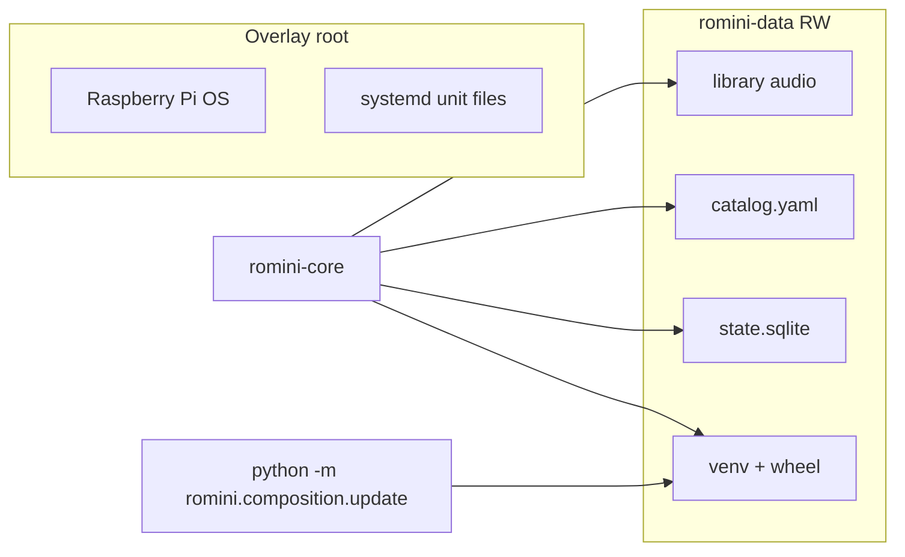

# 0003. OverlayFS OS and a persistent volume for library and install

## Context and Problem Statement

The PRD wants OverlayFS so yanking power is less likely to corrupt the OS, and a parent dashboard that writes audio files. Those conflict if the whole SD is overlayed: uploads vanish on reboot, and `pip install` of a new wheel also vanishes. gpio-build-monitor writes almost nothing on device (no overlay). RoMini must split **immutable OS** from **mutable library**.

## Decision Drivers

* SD longevity and graceful halt (PRD NFR + FR-05).
* Parent uploads must survive reboot.
* OTA wheels must persist (ADR-0002).
* Household tracks must never live in git or in the GitHub Release.

## Considered Options

* Option A: Raspberry Pi overlay on root; extra partition `LABEL=romini-data` mounted at `/var/lib/romini` holding `library/`, `catalog.yaml`, SQLite, and the venv.
* Option B: No overlay; entire root RW (gpio-like). Simpler OTA, weaker SD protection.
* Option C: Overlay everything; remount RW for every upload and update. Easy to get wrong; uploads still race shutdown.

## Decision Outcome

Chosen option: "**Option A**", because it keeps OverlayFS for yank-safety while giving a single place for tracks and the install prefix. Bench breadboards may stay read-write. **Any box that can be yanked** gets `romini-data` + overlay **before** it leaves the bench ([pi-setup.md](../pi-setup.md)).

### Consequences

* Good, because OverlayFS and OTA no longer fight.
* Good, because wiping or cloning a box is: image OS, copy `romini-data`.
* Bad, because first-boot provision must create the partition and fstab (more than gpio’s clone + systemd).
* Bad, because `/etc` systemd units still sit on overlay-backed root; provision copies units onto the lower layer or from `repo/` at boot.
* Do not use `nofail` on the data mount once overlay is enabled.

## Architecture sketch

## Links

* Related ADRs: [0001](./0001-python-hexagonal-daemon.md), [0002](./0002-github-release-wheel-ota.md), [0007](./0007-yaml-catalog-sqlite-session.md)
* Spec / issue: [PRD_001.md](../PRD_001.md) FR-07, NFR Reliability
* Arch norms: library aggregate persistence stays behind a filesystem/SQLite port
