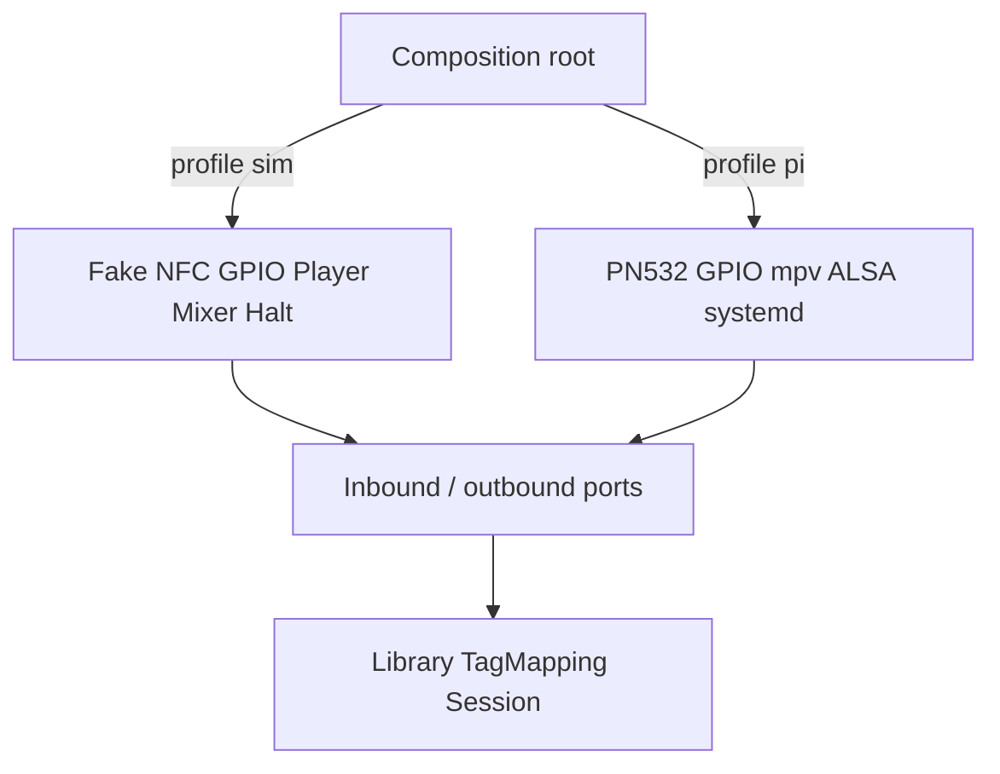

# 0004. Laptop and Pi bind at the composition root

## Context and Problem Statement

gpio-build-monitor emulates hardware by importing `Mock.GPIO` when `__debug__` is true and `RPi.GPIO` when `python -O`. RoMini has more peripherals (NFC, mpv, ALSA, halt) and must TDD play/pause on a laptop. We need a rule for what “local development” means so adapters do not leak into the domain and so `-O` (which also strips asserts) is not the profile switch.

## Decision Drivers

* Hexagonal: only the composition root chooses adapters.
* Domain and slice tests must run on macOS/Linux CI with no SPI, I2S, or systemd.
* gpio’s `-O` trick is a known Pi pattern; copying it would couple every adapter to interpreter flags.

## Considered Options

* Option A: Explicit profile (`sim` vs `pi`) at process start; bind fake or real adapters. Sim exposes injectors (HTTP/CLI) to place/remove a UID, press volume, request halt.
* Option B: gpio-style `if __debug__: Mock else RPi` in each adapter module.
* Option C: QEMU Raspberry Pi OS as the default inner loop.

## Decision Outcome

Chosen option: "**Option A**", because it scales to NFC/player/halt, keeps pytest on a laptop as the inner loop, and leaves QEMU/breadboard for adapter integration. Option B mixes profile with assert stripping and does not cover mpv. Option C is slow and does not help domain TDD.

### Consequences

* Good, because CI never needs a Pi or `python -O`.
* Good, because a real USB NFC reader or local mpv can be swapped in without changing use cases.
* Bad, because sim injectors must not ship enabled on the birthday box (bind only when profile is `sim`).
* Follow-up: OverlayFS and OTA are **not** emulated in `sim`; they stay device/provision tests.

## Architecture sketch

## Links

* Related ADRs: [0001](./0001-python-hexagonal-daemon.md)
* Spec / issue: [guide.md](../guide.md), [development.md](../development.md), [architecture.md](../architecture.md)
* Arch norms: hexagonal composition root; gpio `python -O` is **not** copied
