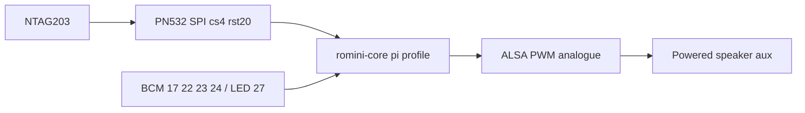

# 0005. PN532 SPI and analogue audio on Pi 4

## Context and Problem Statement

The birthday box is a Raspberry Pi 4 Model B 4GB with a Waveshare PN532 HAT, NTAG203 tags, 16mm buttons, and a **powered speaker on the analogue jack**. The HAT offers I2C, SPI, and UART. The PRD originally sketched I2S DAC audio.

## Decision Drivers

* Waveshare: Pi I2C lacks clock stretching; PN532 I2C can stall the bus.
* HAT SPI RSTPDN defaults to BCM 20, which is also I2S PCM_DIN.
* Speakers need a **line-level** feed: a powered speaker with aux/amp jack, not 4Ω driven from the headphone jack.
* Enclosure cuts and stacked HATs are costly to reverse.
* Extra 16mm buttons for volume and play sit on unused GPIOs (not the HAT SPI pins).

## Considered Options

* Option A: PN532 **SPI** (cs=4, reset=20); audio via Pi 4 **analogue AV jack** into a **powered speaker**; halt BCM 17 / LED 27; vol− 22, vol+ 23, play/pause 24.
* Option B: PN532 I2C (HAT default-looking path).
* Option C: I2S DAC HAT stacked on the NFC HAT with stock RSTPDN on GPIO 20.

## Decision Outcome

Chosen option: "**Option A**", because SPI is the vendor-safe Pi host mode, analogue PWM audio avoids the GPIO 20 clash, and a powered aux speaker matches the household choice (no separate MAX98306). Volume and play are physical 16mm switches.

### Consequences

* Good, because NFC SPI, I2S-free audio, and buttons do not share NSS or GPIO 20.
* Bad, because analogue PWM is noisier than I2S; moving to I2S later needs a new RSTPDN pin and a follow-up ADR.
* Follow-up: official-class ≥3A USB-C PSU; powered speaker with 3.5mm/aux. Passive 3W 4Ω pair is optional spare only.

## Architecture sketch

## Links

* Related ADRs: [0001](./0001-python-hexagonal-daemon.md), [0004](./0004-composition-root-profiles.md)
* Spec / issue: [hardware.md](../hardware.md), [pi-setup.md](../pi-setup.md)
* Arch norms: adapters only; domain still sees Tag UID and Player ports
