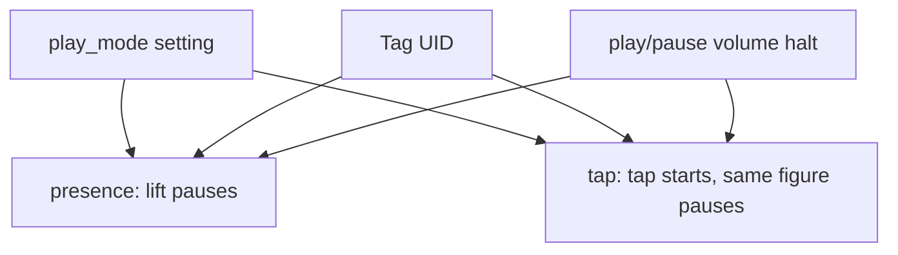

# 0006. Presence and tap play modes

## Context and Problem Statement

The child may keep a Figure on the box (`presence`) or tap a Tag then use transport buttons (`tap`). We need both on one device so the household can try the UX without a reflash. The player itself is a contract; the mode is a persisted setting, not a launch kill switch.

## Decision Drivers

* Birthday box must ship NFC + buttons either way.
* Switching mode must not require a new wheel.
* Assign-tag must not start child audio in either mode.

## Considered Options

* Option A: Setting `play_mode` = `presence` \| `tap` on the data volume and env default; dashboard can change it. Default `presence`.
* Option B: Env-only, SSH to switch.
* Option C: Two images / two wheels.

## Decision Outcome

Chosen option: "**Option A**", because Wi-Fi and the SD card are always available, and both behaviours stay in the behaviour catalog. Default **`presence`**. Assign mode still blocks child play until the parent finishes or 60 seconds idle.

### Consequences

* Good, because TDD can cover both modes without hardware.
* Bad, because NFC + buttons interact; tests must name the mode in each scenario.
* Follow-up: do not treat turning `tap` off as “killing NFC.”

## Architecture sketch

## Links

* Related ADRs: [0001](./0001-python-hexagonal-daemon.md), [0004](./0004-composition-root-profiles.md)
* Spec / issue: [spec.md](../spec.md)
