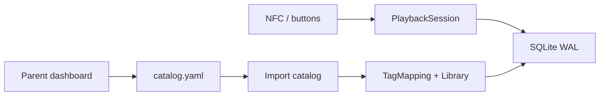

# 0007. YAML catalog import; SQLite for live state

## Context and Problem Statement

Mappings can be written on a laptop and copied onto the data volume. The parent also has a dashboard. Playback position updates often (pause, grace, boot resume). We must choose what is authoritative on disk so a dropped YAML file becomes a Tag → Track without SSH, without rewriting a database by hand.

## Decision Drivers

* SD and Wi-Fi access: dropping a file is the preferred bulk path.
* Position and `play_mode` change at runtime; YAML is a poor WAL.
* One Tag still maps to at most one Track.

## Considered Options

* Option A: **Catalog YAML** is source of truth for Track metadata and Tag mappings. On boot and when the file changes, an import adapter upserts into SQLite. SQLite holds PlaybackSession, volume, and `play_mode`. Dashboard assign **writes the YAML** then imports (no silent SQLite-only mapping).
* Option B: SQLite only (dashboard/API). No drop-in file.
* Option C: YAML only; no SQLite. Positions in the same YAML or a sidecar JSON.

## Decision Outcome

Chosen option: "**Option A**", because a file drop matches how the box is maintained, and SQLite still owns high-churn session state. The daemon **does** pick up a new catalog automatically (start + file change). It does not exist in code yet; this is the adapter contract.

### Consequences

* Good, because birthday figurines can be a committed `catalog.yaml` plus MP3s on `romini-data`.
* Good, because pause/resume does not rewrite YAML every few hundred milliseconds.
* Bad, because two files must stay aligned: audio blobs under `library/` and rows in the catalog.
* Follow-up: invalid YAML or missing MP3 fails that row and leaves others; do not crash the player. A UID removed from YAML is unmapped on the next import (position row may remain unused).

## Architecture sketch

## Links

* Related ADRs: [0003](./0003-overlayfs-writable-library.md)
* Spec / issue: [spec.md](../spec.md), [library-catalog.md](../library-catalog.md)
