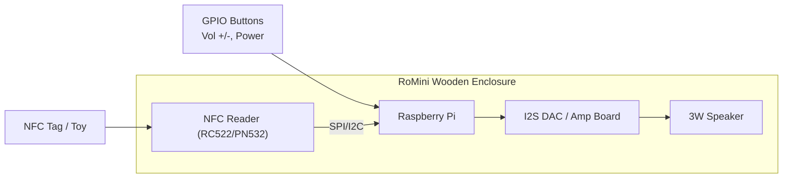

# Product Requirements Document (PRD): RoMini v1.0

## 1. Executive Summary & Objective

RoMini is a self-contained, screen-free physical audio player inspired by the Toniebox form factor. Built for a 5-year-old child, it pairs physical toys with digital audio files via NFC.

The primary objective is to deliver an intuitive, resilient, and delightful listening experience with zero screen friction, while providing parents with a frictionless local workflow to upload content and map NFC tags.

## 2. Target Persona & User Stories

### Primary User: Romy (Child, Age 5)

**Needs:** Independence, instant tactile feedback, durable controls, fun and recognizable characters.

**Stories:**

- As a listener, I want to place my favourite toy on the box so that my story starts playing immediately without asking a grown-up.
- As a listener, I want the story to pause when I pick up my toy and resume when I put it back down so I don't lose my place.
- As a listener, I want easy, large physical buttons to turn the volume up and down safely.

### Secondary User: Parent / Admin

**Needs:** Easy content curation, reliable hardware shutdown (no SD corruption), tag assignment without SSH terminal work.

**Stories:**

- As a parent, I want to drop an MP3/M4A into a local web dashboard and tap a new tag to link them.
- As a parent, I want a safe hardware power switch that initiates a graceful Linux shutdown to protect the OS filesystem.

## 3. Core Functional Requirements

| ID | Feature Area | Description | Priority |
| --- | --- | --- | --- |
| FR-01 | NFC Detection | Read 13.56MHz NFC tags/stickers (NTAG213/215/Mifare) reliably within a 0–3cm detection field. | P0 |
| FR-02 | Audio Playback Engine | Low-latency playback of standard formats (MP3, AAC, FLAC, WAV, M4A) via local mpv daemon. | P0 |
| FR-03 | State Management | Store last-known playback position (timestamp in seconds) keyed by NFC UID in a local SQLite/JSON store. | P0 |
| FR-04 | Debounce & Removal Logic | Tag polling interval of 250ms. If tag is removed, pause after a configurable grace period (e.g., 2 seconds). If same tag is replaced within grace period, continue playing seamlessly. | P0 |
| FR-05 | Safe Power Management | Dedicated momentary GPIO power button initiating `systemctl poweroff` with LED status indicator (steady = ready, pulsing = playing, flashing = shutting down). | P0 |
| FR-06 | Physical Audio Controls | Rotary encoder or dual tactile momentary buttons for volume up/down with a hard software volume ceiling (e.g., max 80dB SPL). | P1 |
| FR-07 | Web Admin Dashboard | Local web portal ([http://romini.local](http://romini.local)) to upload audio files, view mapped tags, and monitor storage/battery. | P1 |
| FR-08 | Dynamic Audio Effects | Play small earcon/chime sound effects upon tag placement and card assignment. | P2 |

## 4. Hardware & Technical Architecture

### System Stack

- **Host Platform:** Raspberry Pi 3A+, 4B, or Zero 2 W running Raspberry Pi OS Lite (64-bit).
- **Application Daemon (`romini-core`):** Python 3.11+ / Node.js daemon managed as a systemd service.
- **Audio Layer:** ALSA + mpv background instance utilizing JSON IPC socket communication.
- **Persistence:** SQLite database mapping `tag_uid`, `file_path`, `title`, `last_position_sec`, and `loop_mode`.

## 5. Non-Functional Requirements

- **Startup Time:** Cold boot to audio-ready state in under 20 seconds.
- **Response Latency:** Audio playback commences within 500ms of NFC contact.
- **Safety:** Software-capped maximum volume output to safeguard hearing.
- **Reliability:** OverlayFS (read-only filesystem mode) enabled for SD card longevity.

## 6. Release Milestones

### Milestone 1: Prototype Core (Breadboard)

- Basic NFC read loop triggering audio files over 3.5mm/USB speaker.
- Debounce and pause/resume logic operational.

### Milestone 2: Enclosure & Controls

- Solder I2S amplifier and speaker into physical enclosure.
- Wire up volume controls and safe shutdown push button.

### Milestone 3: Software Polish & Web UI

- Implement local web interface for uploading files and assigning tags.
- Configure system service auto-boot and read-only filesystem protection.

### Milestone 4: Birthday Launch Edition

- Affix NFC tags to first set of figurines with preloaded fairy tales and music.
