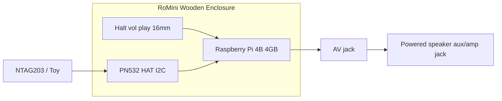

# Product Requirements Document (PRD): RoMini v1.0

## 1. Executive Summary & Objective

RoMini is a self-contained, screen-free physical audio player. Built for a 5-year-old child, it pairs physical toys with digital audio files via NFC.

The primary objective is to deliver an intuitive, resilient, and delightful listening experience with zero screen friction, while providing parents with a frictionless local workflow to upload content and map NFC tags.

This is a **contract** for the birthday box (not a killable product bet). Play mode `presence` vs `tap` is a persisted setting so the household can try both UXes. Spec: [spec.md](./spec.md).

## 2. Target Persona & User Stories

### Primary User: Romy (Child, Age 5)

**Needs:** Independence, instant tactile feedback, durable controls, fun and recognizable characters.

**Stories:**

- As a listener, I want to place my favourite toy on the box so that my story starts playing immediately without asking a grown-up (`presence`).
- As a listener, I want the story to pause when I pick up my toy and resume when I put it back down so I don't lose my place (`presence`).
- As a listener, I want to tap a toy then use large buttons to start, pause, and restart (`tap`).
- As a listener, I want easy, large physical buttons to turn the volume up and down safely (later). For the first box, a grown-up sets loudness on the dashboard.
- As a listener, I want the box to show a light and play a short ready sound when power comes back.

### Secondary User: Parent / Admin

**Needs:** Easy content curation, reliable hardware shutdown (no SD corruption), tag assignment without SSH terminal work.

**Stories:**

- As a parent, I want to copy a YAML catalog and MP3s onto the data volume and have the box map Tags without using the dashboard.
- As a parent, I want to drop an MP3/M4A into a local web dashboard and tap a new tag to link them (that still updates the catalog file).
- As a parent, I want a safe hardware power switch that initiates a graceful Linux shutdown, and for the box to come back when USB power returns even if the cord was yanked.
- As a parent, I want to switch Play mode on the dashboard without flashing a new image.
- As a parent, I want to set how loud stories play on the dashboard while the first box has only a power button.

## 3. Core Functional Requirements

| ID | Feature Area | Description | Priority |
| --- | --- | --- | --- |
| FR-01 | NFC Detection | Read 13.56MHz NFC (launch: NTAG203; also NTAG213/215/Mifare) within 0–3cm. UID only. | P0 |
| FR-02 | Audio Playback Engine | Low-latency MP3, AAC, FLAC, WAV, M4A via local mpv. Track end **stops** (no loop). | P0 |
| FR-03 | State Management | Last position keyed by NFC UID in SQLite. Tag→Track and titles come from `catalog.yaml` imported into that store. | P0 |
| FR-04 | Presence grace | Poll 250ms. Lift pauses after 2s grace; same Tag within grace continues. `tap` mode does not pause on lift. | P0 |
| FR-05 | Safe Power | Momentary halt: LED flash, persist position, `poweroff`. Same button can wake (`gpio-shutdown`). Yank: OverlayFS + auto-start on 5V. Boot: LED + Ready earcon within 20s. | P0 |
| FR-06 | Physical controls | v1: halt+LED only; volume on the parent dashboard with a software ceiling. Later: four 16mm buttons — halt+LED, volume up, volume down, play/pause (long-press = restart). | P0 |
| FR-07 | Web Admin | `http://romini.local` on house WPA Wi-Fi: upload, map tags, Play mode, volume, free space. No battery. No HTTP PIN. | P1 |
| FR-08 | Earcons | Ready earcon on boot (v1). Other chimes remain P2. | P1 (boot only) |
| FR-09 | Play mode | Setting `presence` (default) or `tap`. Assign mode blocks child audio until confirm or 60s idle. | P0 |

## 4. Hardware & Technical Architecture

BOM and pins: [hardware.md](./hardware.md). Runbook: [guide.md](./guide.md). Bring-up detail: [pi-setup.md](./pi-setup.md).

### System Stack

- **Host:** Raspberry Pi 4 Model B (4GB), Raspberry Pi OS Lite (64-bit), 16GB microSD.
- **Daemon:** Python 3.11+ `romini-core` via systemd.
- **NFC:** Waveshare PN532 HAT **I2C**.
- **Audio:** ALSA PWM analogue AV jack → **powered speaker** with amp/aux input; mpv JSON IPC.
- **Persistence:** `catalog.yaml` for mappings + titles; SQLite on `LABEL=romini-data` for position, volume, `play_mode`, and imported catalog rows. No `loop_mode`.

## 5. Non-Functional Requirements

- **Startup:** Cold boot to ready (LED + earcon) in under 20 seconds.
- **Play start:** Within 500ms of a mapped Tag (when play should start).
- **Safety:** Software-capped maximum volume.
- **Reliability:** OverlayFS + `romini-data` on any box that can be yanked. Bench breadboard may stay read-write.
- **Playback offline:** No internet required to listen. OTA uses GitHub + PAT.

## 6. Release Milestones

### Milestone 1: Prototype Core (Breadboard)

- NFC + play/pause domain on `sim`, then PN532 I2C + mpv into the powered speaker.
- Presence grace and tap transport on fakes.

### Milestone 2: Enclosure & Controls

- Halt + LED, powered speaker aux from AV jack. Volume on the parent dashboard for the first box; physical vol± later.
- Halt + gpio-shutdown; boot earcon.

### Milestone 3: Dashboard, overlay, OTA

- Local web: upload, assign, Play mode, free space.
- Overlay + `romini-data` before the box leaves the bench.
- GitHub Release wheels + PAT updater.

### Milestone 4: Birthday Launch Edition

- Affix NTAG203 to figurines; preload `library/` + `catalog.yaml`.
