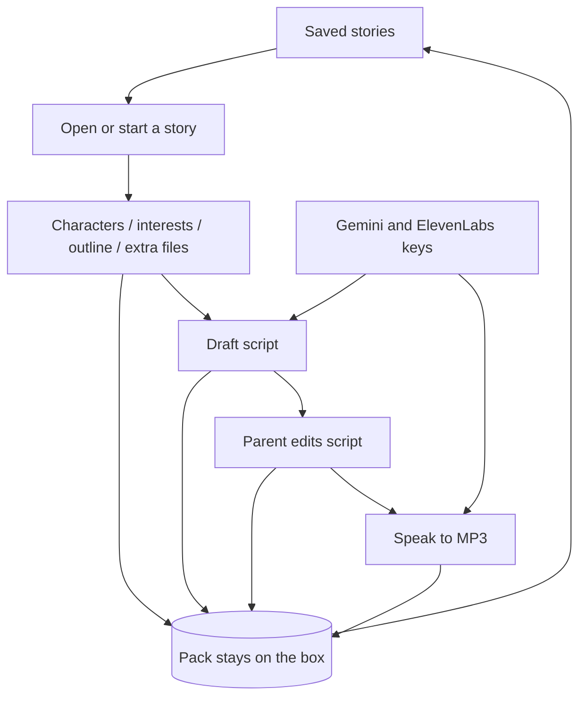

# PRD / bet: Story studio on the parent dashboard

Canonical copy of [PRD: Story studio on the parent dashboard](https://linear.app/mzworthington/document/prd-story-studio-on-the-parent-dashboard-f5b000f53083). Playback contract is unchanged: [spec.md](./spec.md).

## Metadata

| Field | Value |
| -- | -- |
| **Project** | RoMini |
| **Kind** | bet |
| **Status** | ready |
| **Date** | 2026-09-19 |
| **Owner** | Matthew Worthington |
| **Memory** | Story studio bet facts (indicator, timebox). Never secrets. No product flag. |

## Problem

A parent already maps figures and drops MP3s on the house-LAN dashboard. New bedtime stories still start somewhere else: Gemini writes the script from notes the parent keeps in chat (characters, what to cover, an outline), `./bin/story-audio` calls ElevenLabs, then the parent uploads the file and assigns a figure. Those notes and the script live outside the box. If the parent wants a second pass, they hunt the old Gemini thread. We know this from `docs/stories/README.md` and the unused gap on the Library page ("No stories yet. Upload a track, then assign a figure.").

Keys for that work also live off the dashboard today. SSH into `/etc/romini/env` is enough for an operator, but a parent who already uses `http://romini.local` still has to leave the dashboard to make the first draft.

## Belief

We believe that **keeping characters, points to cover, an outline, extra files, and the script on the box, then drafting with Gemini and speaking with ElevenLabs after the parent edits the script** for **the household parent** will **get a story onto a figure and let them reopen it to change the notes or script without leaving** `http://romini.local`.

## Leading indicator

| Field | Value |
| -- | -- |
| **Signal** | Count of stories that were drafted on the dashboard from saved notes, spoken after a parent edit, assigned to a figure, and later reopened |
| **Baseline** | 0 — notes and scripts live in Gemini chat; the dashboard only stores the MP3 after upload |
| **Success** | At least **3** such stories within **14 days** of shipping on the household box |
| **Window** | Decide by **2026-10-17** (week before the RoMini project target of 2026-10-23) |

Do not send this count through a hosted analytics product. The box stays on the house LAN. Count from the saved story packs and what the parent assigned. Feature-usage events would belong in a product with a hosted audience; this bet is one household box.

## Kill criteria

Stop and take the studio slice off the box if, before 2026-10-17:

- **zero** dashboard-made stories are assigned, or
- the parent still keeps characters / outline / script in Gemini chat because the dashboard notes vanish or the draft ignores them, or
- speak runs on a script the parent has not had a chance to edit, or
- draft or speak **breaks upload, assign, play mode, or volume** when a vendor is down.

## Experiment

Cheapest test: a **story pack** on the existing parent dashboard. Same FastAPI + Jinja forms as upload and volume. No new UI framework. Prelaunch, one household — ship it on; no product flag.

1. Parent names a story and writes supporting documents: **characters**, **points to cover / interests**, **story outline**, plus any extra files they attach.
2. Gemini drafts a script from those documents. The parent **must** see and may change the script before anyone spends ElevenLabs characters.
3. ElevenLabs speaks the **current** script with the household voice pool already used by `./bin/story-audio`.
4. The MP3 is a library Track. Assign a figure stays the form that already exists.
5. Notes, script, extra files, and the spoken file stay on the data volume. The parent can open the pack later, change any of them, draft again, or speak again.
6. Parent can save Gemini and ElevenLabs keys on that same dashboard. The page shows which keys are set, never the secret. SSH into the box secrets file remains valid. Draft and speak read keys when they run so a save does not wait on a daemon restart.

Keep `./bin/story-audio` and file upload. Listening stays offline. Generation may use the internet when the parent asks.

## Feature flag

| Field | Value |
| -- | -- |
| **Needed?** | n/a — prelaunch, one household parent. Kill by reverting the slice, not by toggling a flag. |
| **Name** | n/a |
| **Default** | n/a |
| **Audience** | n/a |
| **Owner** | n/a |
| **Expiry** | n/a |

## Settled choices

Named so this card does not wait on another grill.

- **A story pack** holds: title, characters, points to cover / interests, outline, extra files, the current script, and the current spoken MP3.
- **Supporting documents** are those three named notes first. Extra files are optional attachments on the same pack.
- **Parent reviews the script** before speak. Draft never starts narration by itself.
- **Draft and speak are separable.** A parent can type a script if Gemini is down. Empty notes are allowed; a short title still drafts.
- **Persist on the box**, same data volume as the library. Survives refresh and reboot. Current text and current files only — no git-style history.
- **Re-speak** replaces that pack’s MP3. If a figure is already assigned, it keeps playing that Track.
- **Vendors** stay Gemini (script) and ElevenLabs (speech).
- **One household voice per speak**, from named voices in `voices.yaml`. No Voice Lab UI.
- **Dashboard stays FastAPI + Jinja** on the house LAN. Story studio and the keys form do not need a new frontend stack.
- **Keys** the parent types on the dashboard live on the data volume with the library. The GitHub token path (`/etc/romini/env` on the Pi; process env on `sim`) still supplies keys if the dashboard has none. Never in git, never shown again in the page. The GitHub PAT is not a dashboard field.
- **Conventions** stay those in `docs/stories/README.md`.
- **Assign stays a second step.** Auto-mapping a new MP3 onto a figure is out of this bet.
- **Player domain does not learn vendors or notes.** Gemini, ElevenLabs, and the pack stay composition. A spoken file is a Track.

## Out of scope

- Child-facing generation or any screen on the box
- Music beds, multi-voice casts, or cloning a parent’s voice
- In-browser preview of the MP3 (assign and place on `sim`, or play on the box)
- Version history of every draft (only the current pack)
- Publishing scripts or MP3s to git (`docs/stories/` stays gitignored except the README)
- Replacing upload of an MP3 the parent already has
- Playback that needs the internet
- HTTP PIN, Cloudflare, hosted studio, or multi-household accounts
- Hosted secret managers or a GitHub token form
- Picking Gemini models as a product control
- Changing presence / tap, volume, or NFC assign
- React, Next, HTMX, or any new dashboard framework for this bet
- A product feature flag for story studio

## Next

- Stories: [MZW-124](https://linear.app/mzworthington/issue/MZW-124/create-a-bedtime-story-on-the-parent-dashboard) epic
  - [MZW-128](https://linear.app/mzworthington/issue/MZW-128/add-characters-interests-an-outline-and-extra-files-to-a-story) supporting documents
  - [MZW-126](https://linear.app/mzworthington/issue/MZW-126/draft-a-bedtime-script-from-story-notes-and-edit-it-before-narration) draft and edit before speak
  - [MZW-127](https://linear.app/mzworthington/issue/MZW-127/turn-the-current-script-into-a-narration-mp3-i-can-speak-again) speak and re-speak
  - [MZW-129](https://linear.app/mzworthington/issue/MZW-129/reopen-a-saved-story-with-its-notes-script-and-files) persist and reopen
  - [MZW-125](https://linear.app/mzworthington/issue/MZW-125/save-gemini-and-elevenlabs-keys-on-the-parent-dashboard) keys on the dashboard, with the box secrets file still valid
- Spec: `agent-spec` when the first playable story is claimed — Gherkin for persist-after-reboot, keys-missing, vendor-down, and upload still working
- After the window: keep the slice, or revert it

Procedure: Waykit hypothesis-driven development. Voice: practitioner, no slogans.
