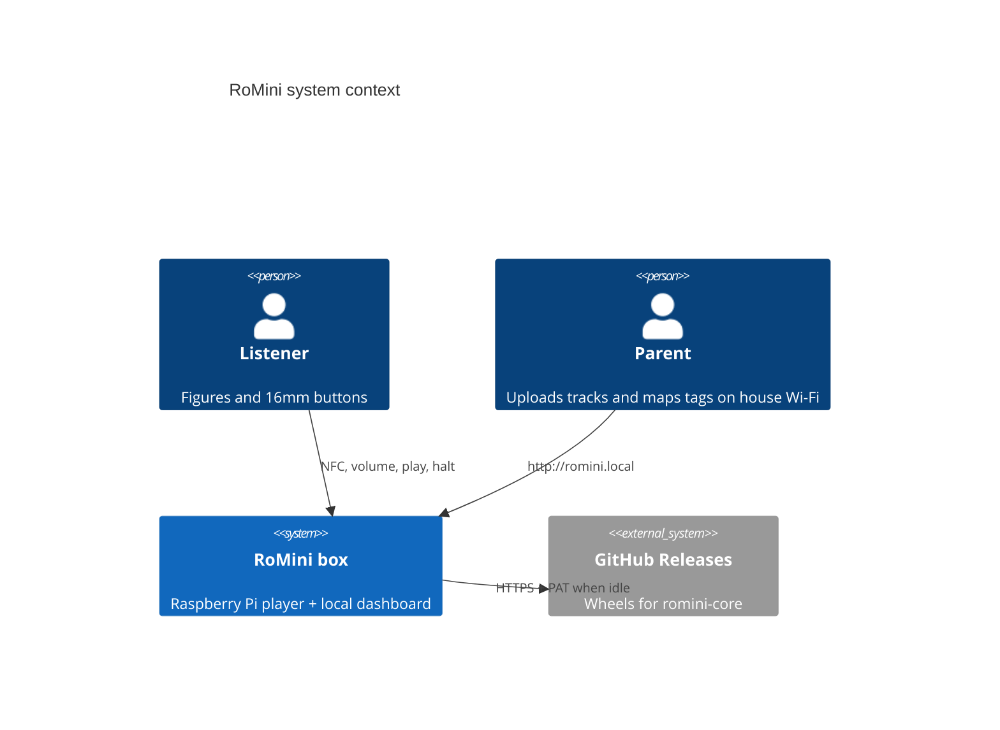
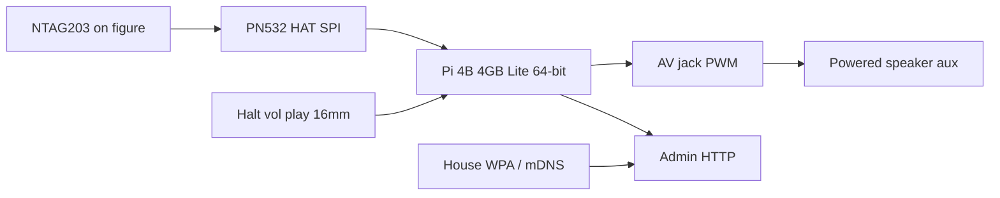
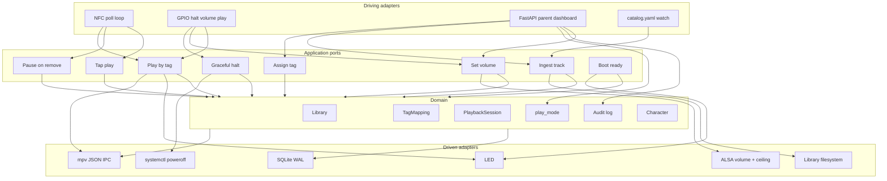
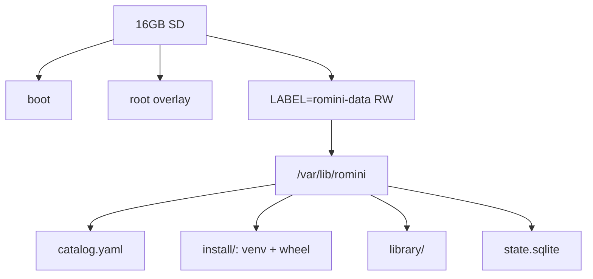

# RoMini technical architecture

Planning artefact for the Raspberry Pi player. Operator steps: [guide.md](./guide.md). Product: [PRD_001.md](./PRD_001.md). Behaviour: [spec.md](./spec.md). Decisions: [ADRs](./ADRs/README.md).

gpio-build-monitor is the operational template for **device install, systemd, and GitHub Release wheels**. Playback stays offline. OTA uses a PAT against public Releases.

## 1. Context

Listening never depends on GitHub.

## 2. Hardware

BOM and pins: [hardware.md](./hardware.md). Bring-up: [pi-setup.md](./pi-setup.md). NFC bus: [ADR-0009](./ADRs/0009-pn532-spi.md). Audio: [ADR-0005](./ADRs/0005-pn532-spi-analogue-audio.md). Play modes: [ADR-0006](./ADRs/0006-presence-and-tap-play-modes.md).

## 3. Hexagonal software

`romini-core` is one Python 3.11+ process ([ADR-0001](./ADRs/0001-python-hexagonal-daemon.md)).

### Aggregates

| Aggregate | Invariants |
|-----------|------------|
| **Library** | Tracks only on `romini-data`. Uploads never rewrite git or overlay. Disk full fails closed. |
| **TagMapping** | One UID → at most one Track. Unmapped UID does not start a Track. EEPROM unread/unwritten. |
| **PlaybackSession** | Position seconds keyed by UID. End of Track stops. Presence grace 2s. Assign mode: no child audio. |
| **Settings** | `play_mode` is `presence` (default) or `tap`. Volume ≤ ceiling. |

### Vertical slices

| Slice | Intent |
|-------|--------|
| Boot ready | LED + Ready earcon; resume only if `presence` and mapped Figure still on coil |
| Presence play | Figure down → play; lift past grace → pause |
| Tap play | Tap starts Track; same Figure tap pauses; lift does not pause |
| Assign tag | Parent links Tag; blocks child play until done or 60s |
| Register figures | Parent taps a Figure; catalog `tags` lists UID; name on dashboard; assign dropdown |
| Catalog import | Drop or edit `catalog.yaml`; box maps Tags without dashboard |
| Ingest track | Parent adds audio on the LAN; dashboard writes catalog + files |
| Volume | Dashboard quieter/louder/level with software ceiling; 16mm ± later |
| Transport | Play/pause; long-press restarts |
| Graceful halt | Short-press → persist → flash → poweroff |

## 4. Disk layout and OverlayFS

Label **`romini-data`** → `/var/lib/romini` ([ADR-0003](./ADRs/0003-overlayfs-writable-library.md)). Bench may stay RW. Boxes that can be yanked get overlay **before** they leave the bench. Do not `nofail` that mount once overlay is on.

## 5. Over-the-wire updates

gpio-style venv `python -m romini.composition.update` + timer ([ADR-0002](./ADRs/0002-github-release-wheel-ota.md)). Public repo; optional **PAT** in `/etc/romini/env`. `apply_update` skips while mpv IPC says a Track is playing. Force a check from SSH: [README — Update the player](../README.md#update-the-player). First install: `bin/install-pi`. Do not `git pull` the daemon.

## 6. Parent dashboard

Screenshots: [dashboard.md](./dashboard.md). `http://<hostname>.local` on house WPA when Avahi + port 80 are on (`romini-core` binds 80 via `CAP_NET_BIND_SERVICE`). Laptop: `127.0.0.1` and `ROMINI_DASHBOARD_PORT`. No HTTP PIN, no Cloudflare. The masthead shows free space and remaining charge from the Waveshare UPS HAT (D) when INA219 `0x43` is on i2c-1; the laptop `sim` omits charge. Assign and upload **write `catalog.yaml`**. Play mode and volume live here (SQLite, not YAML). The Audit log on Settings lists what the box has done (newest first, last 1000). The first box has a halt button only, so loudness is set on this page. Dashboard starts only if `ROMINI_DASHBOARD_PORT` is set.

## 7. Runtime

| Unit | Role |
|------|------|
| `romini-core.service` | NFC, mpv, GPIO, FastAPI; `enable`d so 5V always starts the player |
| `romini-update.timer` | oneshot `python -m romini.composition.update` |
| dtoverlay gpio-shutdown | BCM 17 (pin 11) sleeps; the same switch on BCM 3 (pin 5) wakes |

Profiles `sim` / `pi`: [ADR-0004](./ADRs/0004-composition-root-profiles.md), [development.md](./development.md).

LED: boot animation, then steady = ready, pulse = playing, flash = shutting down.

### Ports

Domain talks these; adapters bind in `sim` / `pi` (`src/romini/`).

| Port | Direction | Role |
|------|-----------|------|
| Nfc | in | Current Tag UID or none, 250ms (`poll_nfc` in `run_core_ticks`) |
| Buttons | in | Halt, vol±, play/pause (`apply_gpio_press` / TTY / sim HTTP). Not yet in the core tick loop |
| Catalog | in | Load/watch YAML mtime; dashboard writes it |
| Player | out | Play path + position, pause; `sim` silent, `pi` mpv |
| LibraryStore | out | SQLite cache after YAML import |
| SessionStore | out | Position, volume, play_mode in `state.sqlite` |
| AuditLog | out | Newest-first box events in `state.sqlite`; last 1000 rows |
| Mixer | out | Volume with ceiling |
| Battery | in | Remaining charge percent from UPS HAT (D) pack voltage; omitted when the HAT is missing |
| StatusLed | out | Pulse / flash (GPIO 27 on `pi`) |
| Halt | out | `LoggingHalt` on `sim`; `systemctl poweroff` on `pi` |

## 8. CI / release

PR: `pre-commit --all-files` + `make test` (ruff, pytest). `main`: semantic-release wheel on GitHub Releases. Device timer installs the wheel with PAT.

## 9. Implementation order

1. Domain + presence/tap slices on `sim` — done ([spec.md](./spec.md)).
2. Breadboard: PN532 SPI + mpv into powered speaker — soak.
3. Halt + LED in `run_core_ticks`, halt wake, boot earcon on device — soak / remaining GPIO poll. Volume on the dashboard for the first box; physical vol± later.
4. Dashboard + provision files + updater skip-while-playing — laptop complete; overlay on device.
5. Birthday: `library/` + `catalog.yaml` + affixed Tags.

## 10. Open questions

- Exact powered-speaker SKU (aux/amp jack).
- Official 5V ≥3A USB-C PSU model.
- When (if ever) to move RSTPDN and adopt I2S.
