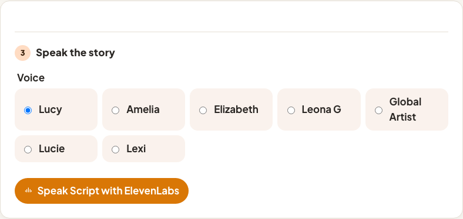

# Parent dashboard

House-LAN UI. Laptop: `./bin/sim` → [http://127.0.0.1:8080](http://127.0.0.1:8080). Pi: `http://<hostname>.local`. Walkthrough: [guide.md](./guide.md) §1.4. Contract: [spec.md](./spec.md).

Screenshots live in [`images/`](./images/). Refresh them with `make screenshots` (Playwright, not part of `make test`).

## Live player

Now playing, the volume cap, and the figure on the plate.

## Library

Upload a file or folder, assign a figure to a library track, then preview the audio.

## Figures

Name tags and link the story each one should play. Paste a UID on the sim harness.

## Story studio

Title, length, characters, outline, and script. Save and Draft script sit on this page.

Voice picker and Speak script (ElevenLabs). Needs a key on Settings.

## Characters

Reusable names and history for drafts. Open a row to edit.

## Settings

Gemini and ElevenLabs keys (masked once set), play mode (presence vs tap), and volume.

Audit log: last 1000 box events, newest first.

## Sim harness

`sim` only. Paste a UID, put it on the plate or tap, and press box buttons without GPIO.

