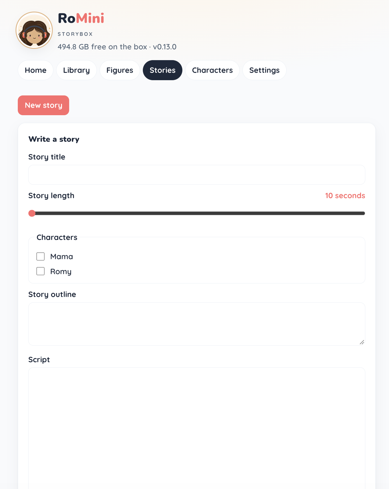

# Parent dashboard

House-LAN UI. Laptop: `./bin/sim` → [http://127.0.0.1:8080](http://127.0.0.1:8080). Pi: `http://<hostname>.local`. Walkthrough: [guide.md](./guide.md) §1.4. Contract: [spec.md](./spec.md).

Screenshots live in [`images/`](./images/).

## Home

Masthead (free space, version) and a map of the other tabs.

## Library

Upload a file or folder, assign a figure to a library track, preview audio, then Place on `sim`.

## Figures

Turn NFC register on, present a UID (sim), and name tags.

## Stories

Title, length, characters, outline, and script. Save / Draft script sit on this page. Filename `image.png`.

Voice picker and Speak script (ElevenLabs). Needs a key on Settings.

## Characters

Reusable names and history for drafts. Open a row to edit.

## Settings

Gemini and ElevenLabs keys (masked once set) and play mode (presence vs tap). Volume lives here too; not in this crop.

Audit log: last 1000 box events, newest first.

## Sim harness

`sim` only. Paste a UID, put it on the plate or tap, and press box buttons without GPIO.

