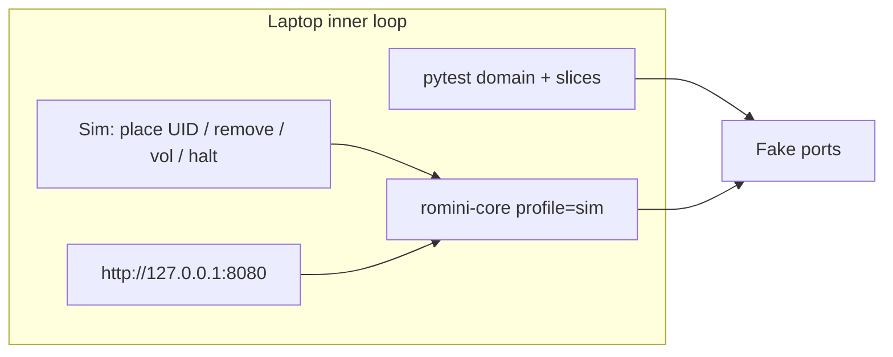

# Local development and emulation

How to work on RoMini **without a Raspberry Pi**. Runtime choice: [ADR-0004](./ADRs/0004-composition-root-profiles.md). Product behaviour: [PRD_001.md](./PRD_001.md). Device layout: [architecture.md](./architecture.md).

gpio-build-monitor runs the same process on a laptop by swapping `RPi.GPIO` for `Mock.GPIO` when `__debug__` is set (`python` vs `python -O`). RoMini does **not** copy that. Too many peripherals, and `-O` also disables asserts. The composition root binds a **profile**.

## Profiles

| Profile | Where | Adapters |
|---------|--------|----------|
| `sim` | Laptop, CI | Fakes for NFC, GPIO, mixer, halt; library on `./var/romini`; FakePlayer in CI; **mpv** if present for manual listen |
| `pi` | Box / breadboard | PN532 SPI, GPIOs 17/22/23/24/27, mpv+ALSA analogue, `systemctl poweroff` |



Default for `uv run` / `mise` on a checkout: `sim`. systemd on the device: `pi`. Never detect “am I a Pi?” inside domain code.

## What we emulate vs what we do not

| Surface | `sim` | Notes |
|---------|-------|-------|
| NFC field | **FakeNfc** | Inject UID; 250ms poll |
| Buttons | **FakeButtons** | Halt, vol±, play/pause, long-press restart |
| Play mode | Real settings | `presence` and `tap` both in tests |
| Catalog | Real YAML import | `$ROMINI_DATA/catalog.yaml` |
| Library files | Directory on the laptop | Not OverlayFS; path via env (`ROMINI_DATA`) |
| Parent dashboard | FastAPI on localhost | Same routes; Avahi/`romini.local` is Pi-only |
| Audio | **FakePlayer** in tests; optional mpv on laptop | CI must not require speakers |
| OverlayFS / `romini-data` | **Not emulated** | Provision + Pi soak |
| OTA | **Not inner loop** | Fake GitHub API + PAT header in updater tests |
| Mixer ceiling | Fake mixer | SPL later on device |

We emulate **child and parent intent** (figure down, figure up, upload, assign). We do not emulate the SD overlay stack on a Mac.

## Inner loop

```bash
./bin/bootstrap   # venv, ruff, pytest, pre-commit, commit-msg
make test         # ruff check + format --check, pytest
```

Python is formatted with **ruff format** (the Python equivalent of Prettier). YAML and JSON use Prettier via pre-commit. Hooks: ruff + Prettier on commit; pytest on **pre-push**; conventional commit subjects on **commit-msg**. CI (`.github/workflows/ci.yml`) runs the same `make test` on PRs and `main`; merge to `main` with `feat`/`fix` under `src/` or `pyproject.toml` cuts a GitHub Release tag and updates `CHANGELOG.md` via python-semantic-release.

1. Red-green domain and slice tests with fakes (TDD guard). First catalog case: mapped Figure in `presence` (`src/romini/features/play_by_tag/`).
2. `ROMINI_PROFILE=sim ROMINI_DATA=./var/romini romini-core` (or `python -m romini`) loads `catalog.yaml` + `library/` and exits; no NFC poll loop yet.
3. Open the dashboard on localhost **or** drop `catalog.yaml` + files under `$ROMINI_DATA`. Use the **sim panel** (only in `sim`) to place a canned UID.
4. Breadboard: same binary, `ROMINI_PROFILE=pi`, [pi-setup.md](./pi-setup.md) — domain unchanged.

## Sim injectors

Driving adapters in `sim` only:

- HTTP (localhost, not advertised on LAN): place UID, remove tag, volume step, halt (logs instead of poweroff).
- Optional TTY: same commands for when the browser is not open.

These routes are compiled out or refused when profile is `pi`.

## Audio on a laptop

- **Tests:** `FakePlayer` records play/pause/seek; no mpv.
- **Manual listen:** if `mpv` is on `$PATH`, the sim composition root may bind the real player adapter to the laptop speakers. Missing mpv is not a test failure.

## CI

Same as `sim` with `FakePlayer` only. No QEMU job in v1. A later optional workflow can flash/smoke a real Pi.

## Explicitly out of scope for emulation

- QEMU Raspberry Pi as the daily driver.
- Importing `RPi.GPIO` behind `python -O`.
- Running OverlayFS in Docker to “feel like” the SD card.
- Shipping the sim panel on the child’s box.
