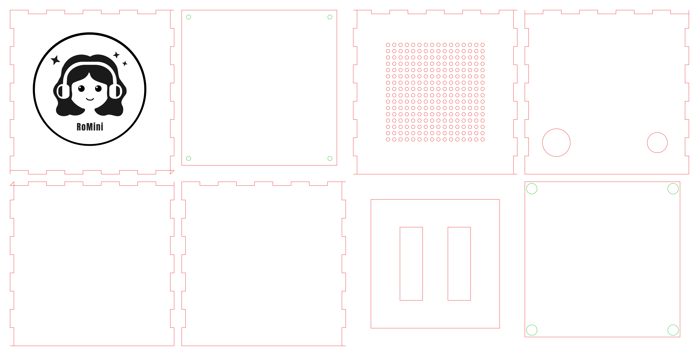
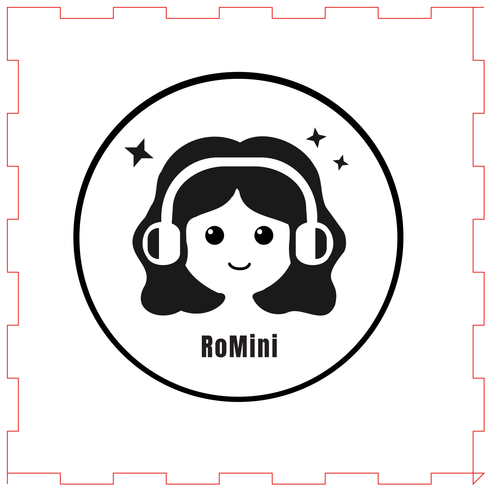

# Fabrication

The wooden cube is one sheet of 3.0 mm Baltic birch. Outside it is 130 × 130 × 130 mm. The cut file, the logo master and the shop letter are in [`fabrication_package/`](../fabrication_package/RoMini_Storybox_Fabrication_Package/).

Top row, then bottom row: lid, bottom panel, front, back, left side, right side, speaker baffle and Pi shelf.

## What the shop cuts

Red is a through-cut. Black fill is an engrave. Green is a drill.

| Piece | What it is |
|-------|------------|
| Lid | Finger joints. The logo is engraved about 0.5 mm. About 2.5 mm of wood remains. Do not cut through the lid. |
| Bottom | 123 × 123 mm. It drops into the 124 mm cavity and unscrews. Four green 3.4 mm holes, 5.5 mm from each corner, are clearance for M3 screws. |
| Front | Finger joints on the top and sides, straight bottom edge. 16 × 16 grille, 2.8 mm holes on a 5.0 mm pitch. |
| Back | 22 mm USB-C hole (centre 25, 105) and 16 mm button hole (centre 105, 105), from the panel's top-left. Straight bottom edge. |
| Sides | Finger joints on the top and sides, straight bottom edge. |
| Speaker baffle | 102 × 102 mm, behind the grille. Two 18 × 58 mm openings for the [30 × 70 mm enclosed speakers](https://thepihut.com/products/stereo-enclosed-speaker-set-3w-4-ohm), long side vertical. No screw holes. Those speakers are passive 4 Ω and need an amplifier. |
| Pi shelf | 123 × 123 mm. Four green 8.4 mm holes, 5.5 mm from each corner, clear the 8 mm dowels. Glue it about halfway up so the Pi sits nearer the NFC hat. Drill the Pi mounting holes by hand. |

Finger joints are nine per edge and 3.0 mm deep. The shop adds R1.6 mm dogbones for a 1/8 in downcut bit. [`Sheet2_3mm_BalticBirch_TopLid.svg`](../fabrication_package/RoMini_Storybox_Fabrication_Package/01_Vector_CAD_Files/Sheet2_3mm_BalticBirch_TopLid.svg) is the logo master. Do not cut it as a separate part. The cut file is [`RoMini_Storybox_3mm_Cube.svg`](../fabrication_package/RoMini_Storybox_Fabrication_Package/01_Vector_CAD_Files/RoMini_Storybox_3mm_Cube.svg).

## What is not on the sheet

Four 8 mm hardwood dowels, 124 mm long. Glue one in each interior corner, from the underside of the lid to the inside face of the bottom panel. The dowel centre is 6 mm from each inner wall, in line with the M3 hole. Drill a 2.5 mm pilot about 10 mm into the bottom end. An M3 × 12 mm screw passes through the bottom panel into that end.

The walls and the lid are glued. The bottom stays screwed so the Pi, the battery and the card can come out.

Shop letter: [CNC_Machining_Brief.txt](../fabrication_package/RoMini_Storybox_Fabrication_Package/03_Specifications/CNC_Machining_Brief.txt). Full notes: [Technical_Specifications.txt](../fabrication_package/RoMini_Storybox_Fabrication_Package/03_Specifications/Technical_Specifications.txt). Parts and wiring: [hardware.md](hardware.md).
