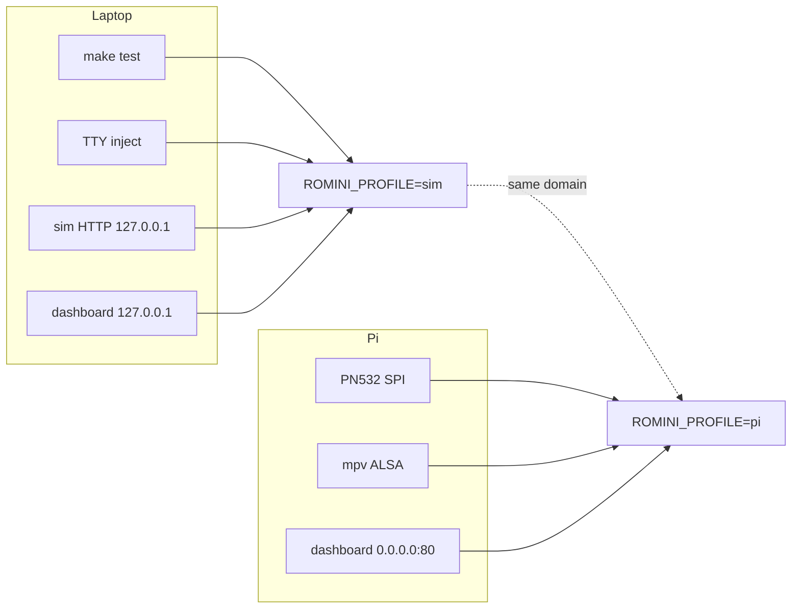
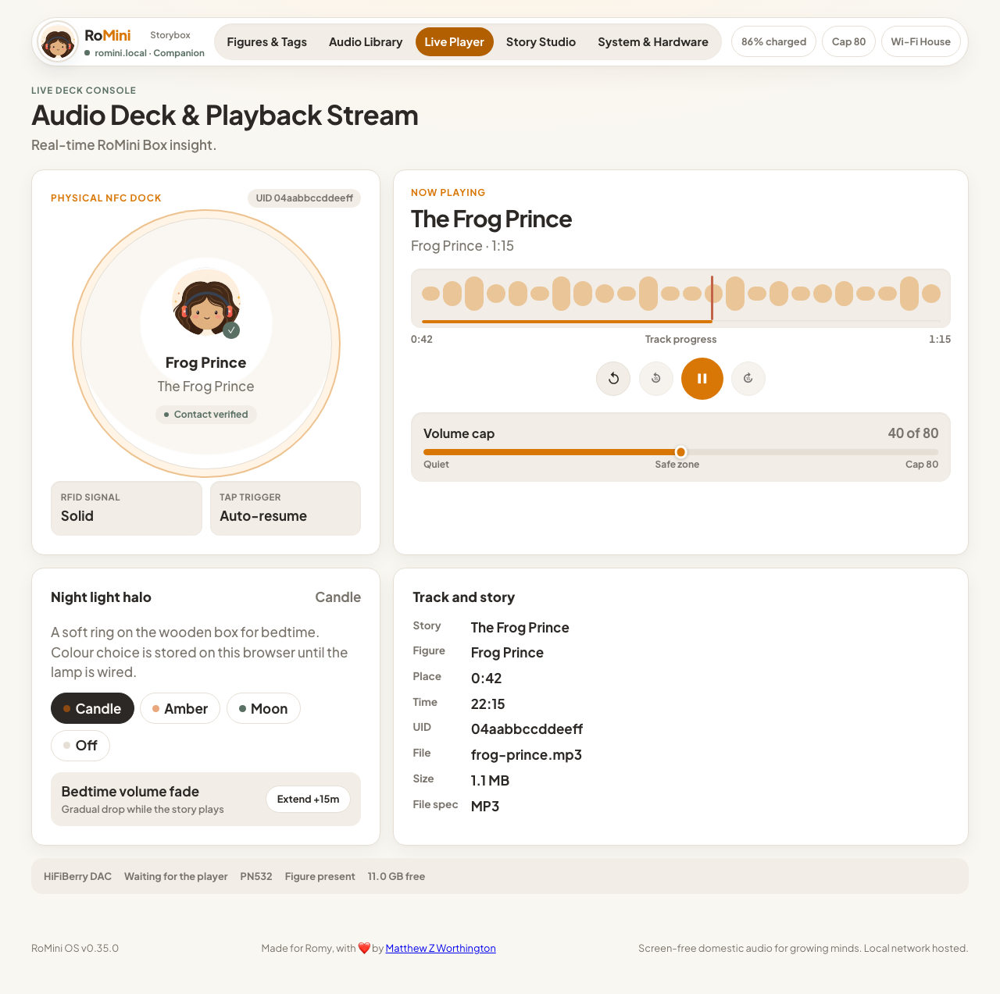
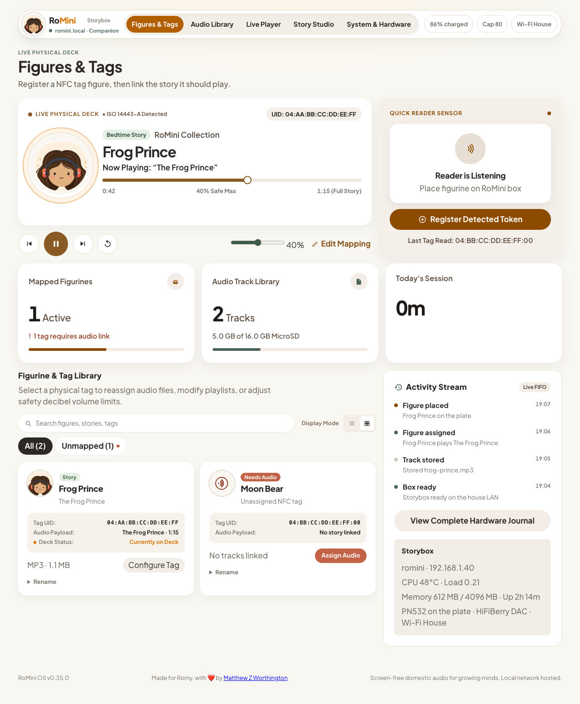
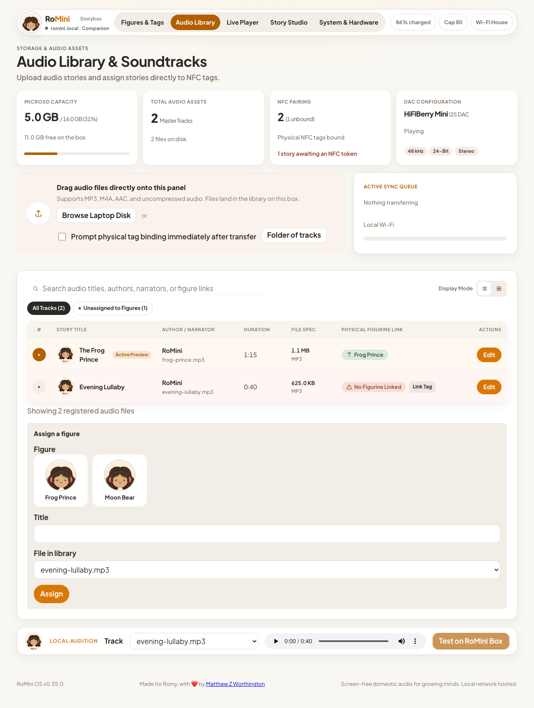
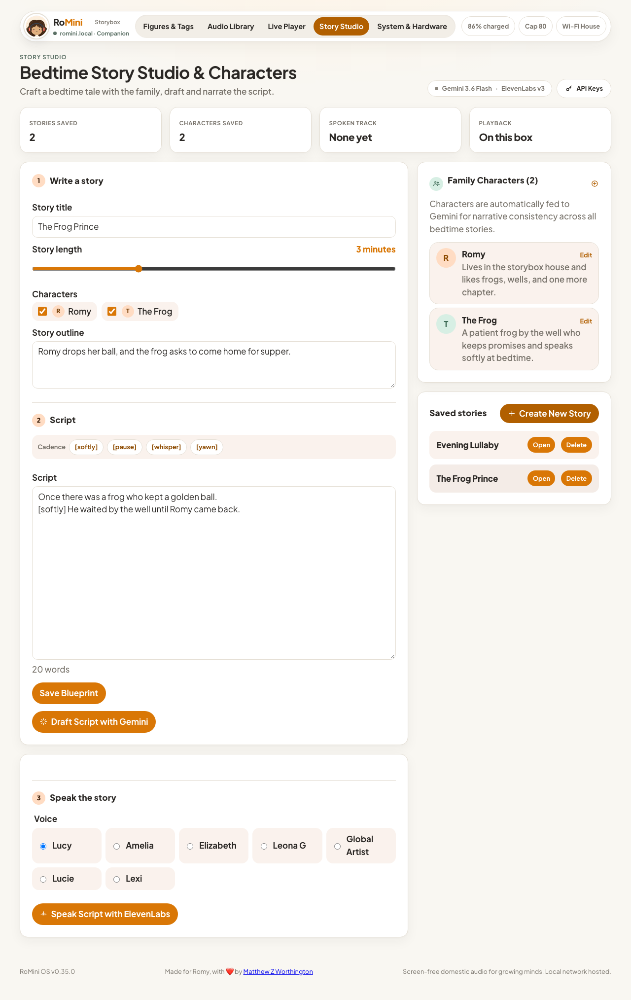
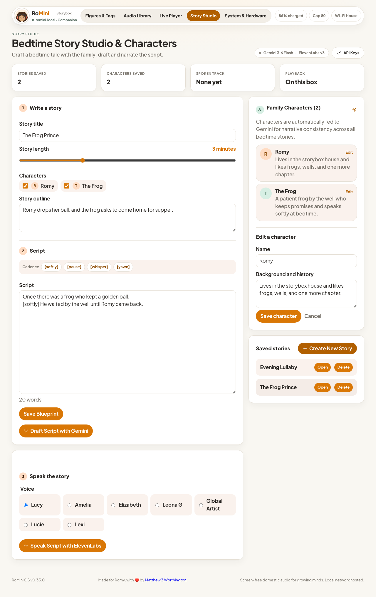
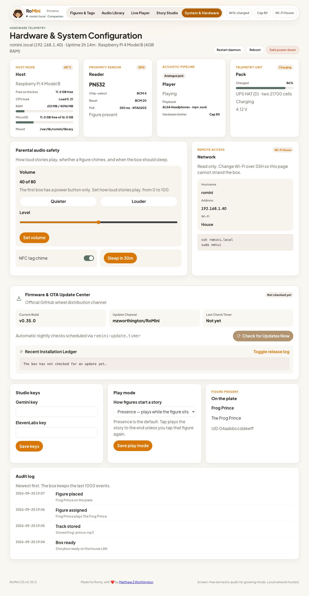
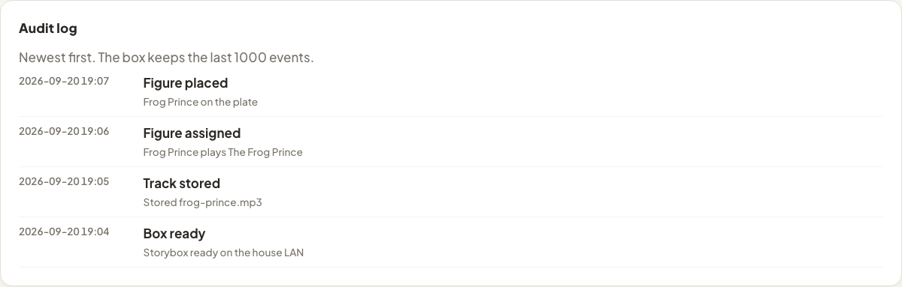
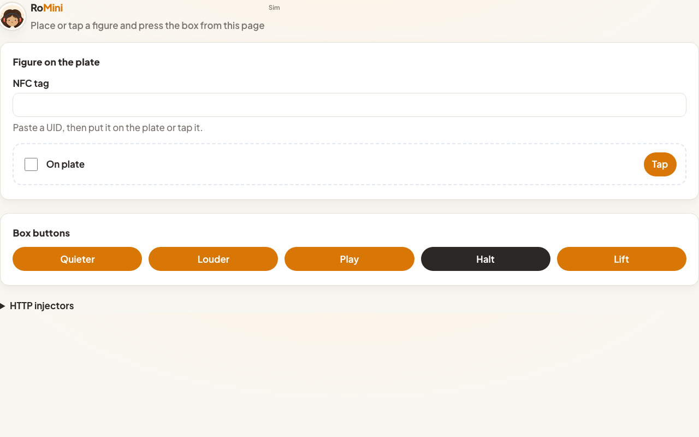

# Step-by-step: laptop, emulation, Pi

Operator walkthrough. Behaviour: [spec.md](./spec.md). Why two profiles: [ADR-0004](./ADRs/0004-composition-root-profiles.md). Hardware: [hardware.md](./hardware.md).

There is **no QEMU Raspberry Pi** in the inner loop. Emulation is the **`sim` profile**: same domain, fake NFC/GPIO/halt/player, real YAML catalog and SQLite on a laptop directory.



| Env | Meaning | Default |
|-----|---------|---------|
| `ROMINI_PROFILE` | `sim` or `pi` | `sim` |
| `ROMINI_DATA` | Data tree (`library/`, `catalog.yaml`, `state.sqlite`, `install/`, `repo/`) | **required** |
| `ROMINI_DASHBOARD_PORT` | Parent FastAPI. Unset = no dashboard | unset |
| `ROMINI_HTTP_PORT` | Sim injectors only. Unset = no sim HTTP | unset |
| `GITHUB_TOKEN` | PAT for Releases (OTA). Never in git | unset |
| `GITHUB_REPO` | Releases repo | `mzworthington/RoMini` |

`romini-core` on `sim` reads **stdin first**. Dashboard and sim HTTP start **after stdin closes** (EOF or `quit`). For a long-running laptop daemon, close stdin (`</dev/null`).

---

## 1. Local development

### 1.1 Bootstrap

Python 3.11+ (`mise` if installed).

```bash
./bin/bootstrap
source .venv/bin/activate
make test
```

That is ruff check, ruff format `--check` and pytest. Pre-commit: ruff + Prettier on commit; **full** pytest on pre-push; conventional subjects on commit-msg.

CI (`.github/workflows/ci.yml`) runs the same `make test`. Merge to `main` with `feat`/`fix` under `src/` or `pyproject.toml` can cut a GitHub Release wheel.

### 1.2 Data tree

`load_sim_box` creates this if the directory is empty:

```text
$ROMINI_DATA/
  catalog.yaml    # tracks: []
  library/        # MP3s; YAML `path` is relative to here
  install/        # venv on the Pi (Release wheel)
  state.sqlite    # WAL: position, volume, play_mode, audit log
```

Laptop example: `mkdir -p ./var/romini`.

### 1.3 Interactive TTY (emulated figure / buttons)

```bash
export ROMINI_PROFILE=sim
export ROMINI_DATA="$PWD/var/romini"
.venv/bin/romini-core
```

Type one command per line. `quit` exits.

| Line | Effect |
|------|--------|
| `place <uid>` | Figure down (UID lowercase hex) |
| `lift` / `remove` `[position]` | Figure up after grace; optional position seconds |
| `vol up` / `vol down` | Mixer step |
| `play` | Play/pause |
| `play long` | Restart Track |
| `halt` | Persist, flash LED, log halt (no `poweroff`) |
| `quit` | Stop reading stdin |

Player on `sim` is **silent** (`SilentPlayer`): no speakers, but it still remembers play/pause so the dashboard Now playing panel can update. Tests use `FakePlayer`. The laptop does not auto-bind mpv. Audio files still need to exist for catalog import.

Add a mapped Track, then place its UID:

```bash
# in another shell, or before starting
cat > var/romini/catalog.yaml <<'EOF'
tracks:
  - uid: "04aabbccddeeff"
    path: "frog.mp3"
    title: "The Frog Prince"
EOF
# put a real mp3 at var/romini/library/frog.mp3
```

Then `place 04aabbccddeeff`. Domain starts the Track; you will not hear it on `sim`.

### 1.4 Dashboard + sim HTTP (long-running)

```bash
./bin/sim
```

Creates `var/romini` if needed, sets `ROMINI_PROFILE=sim`, binds the parent dashboard on **8080** and sim injectors on **8081**, and closes stdin so HTTP starts immediately. Override with `ROMINI_DATA`, `ROMINI_DASHBOARD_PORT`, or `ROMINI_HTTP_PORT`.

- Parent UI: `http://127.0.0.1:8080`. Free space, **volume**, library table, registered figures, Register mode, upload, assign, play mode, **Audit log** on Settings. Unknown figures go on the plate from the sim harness. Tab notes: [dashboard.md](./dashboard.md).
















- Sim injectors (localhost only; refused on `pi`):

```bash
curl -sS -X POST http://127.0.0.1:8081/place/04aabbccddeeff
curl -sS -X POST http://127.0.0.1:8081/remove
curl -sS -X POST http://127.0.0.1:8081/vol/up
curl -sS -X POST http://127.0.0.1:8081/vol/down
curl -sS -X POST http://127.0.0.1:8081/play
curl -sS -X POST http://127.0.0.1:8081/halt
```

Dashboard routes: `GET /`, `GET /storage`, `POST /tracks`, `POST /assign`, `POST /register-mode`, `POST /tags/<uid>/name`, `PUT`/`POST /play-mode`, `POST /volume`, on `sim` `POST /place/<uid>`. Assign, register, and upload write `catalog.yaml`. Play mode, volume, and the Audit log are SQLite, not YAML.

### 1.5 What `sim` covers

| Surface | On the laptop |
|---------|----------------|
| NFC | `FakeNfc` + inject UID. Poll loop only when `nfc=` + `ticks` are passed (Pi `entry`, or tests) |
| Buttons | TTY / HTTP injectors. No real GPIO |
| Halt | `LoggingHalt` (log, no poweroff) |
| Catalog | Real YAML import + mtime watch when the core tick loop runs |
| Library | Files under `$ROMINI_DATA/library` |
| Session / volume / play mode / Audit log | SQLite WAL `state.sqlite` |
| Dashboard | Same FastAPI; bind `127.0.0.1` |
| Audio | Silent. CI must not need speakers |
| OverlayFS, Avahi, gpio-shutdown | Not emulated |
| OTA | Tests + `python -m romini.composition.update` against GitHub; not the inner loop |

---

## 2. Emulation (what we refuse)

gpio-build-monitor swaps `RPi.GPIO` when `python -O`. RoMini does **not**. `-O` also strips asserts. Profile is `ROMINI_PROFILE` at the composition root only.

Out of scope:

- QEMU as the daily driver
- OverlayFS in Docker “like the SD”
- Shipping sim HTTP on the birthday box (`start_sim_http` raises if profile is not `sim` or host is not localhost)
- Importing `RPi.GPIO` to decide the profile

Breadboard is a real Pi with `ROMINI_PROFILE=pi` ([section 3](#3-pi-setup)). Domain tests stay on the laptop.

---

## 3. Pi setup

Hardware why: [hardware.md](./hardware.md). Units and fstab snippets are in `deploy/` (same strings as `romini.composition.provision`).

### 3.1 Bench kit

Pi 4B 4GB, PN532 HAT, NTAG203, **four** 16mm buttons (one with LED), powered speaker **aux**, 16GB microSD, **≥3A USB-C**, house WPA.

### 3.2 Flash

Raspberry Pi Imager → **Lite 64-bit**. SSH (key), Wi-Fi. Prefer hostname `romini` and user `pi` so the checked-in units match; Imager will happily create another name (this box used `romini` / `RoMini`). Dashboard is `http://<hostname>.local` (Avahi `%h`), not a hardcoded `romini.local`. Do not expand the whole card if you will add `romini-data` before yank-risk.

### 3.3 PN532 SPI

Jumpers: I0 **L**, I1 **H**, RSTPDN **BCM 20**. DIP **SCK MISO MOSI NSS ON**; SCL/SDA and RX/TX **OFF**. Unplug 5V after changing I0/I1. Coil toward the lid.

```bash
sudo raspi-config nonint do_spi 0
sudo raspi-config nonint do_i2c 0
sudo reboot
```

`i2cdetect -y 1` should show **43** (UPS), not **24**. Confirm a UID with the venv `PN532_SPI(reset=20, cs=4)` **before** trusting software.

### 3.4 Buttons and speaker

Power off. Halt: COM GND, NO **BCM 17**, LED − GND, LED + **BCM 27**. Vol− **22**, vol+ **23**, play **24** (NO to pin, COM GND).

```bash
sudo tee -a /boot/firmware/config.txt < /tmp/romini-provision/config.txt.romini
# older images: /boot/config.txt
# generate snippets: venv python -m romini.composition.provision /tmp/romini-provision
```

That is `dtoverlay=gpio-shutdown,gpio_pin=17` so halt can wake.

AV jack → speaker aux. `speaker-test -c 2` or `mpv` at low volume. Software volume ceiling still applies.

**Core loop today** polls NFC + catalog every 250 ms. GPIO pin handlers exist (`apply_gpio_press`) and are covered in tests; they are not yet wired into `run_core_ticks`. On the bench, use sim HTTP/TTY against a laptop or wait for that poll to land. LED pulse uses `RPi.GPIO` on pin 27 when `ROMINI_PROFILE=pi`.

### 3.5 Disk (before yank-risk)

Bench breadboard may keep `/var/lib/romini` on RW root.

Before the box leaves the bench:

1. Shrink `rootfs` (~6GB). Partition 3: `mkfs.ext4 -L romini-data`.
2. Append `deploy/fstab.romini-data` to `/etc/fstab` (`LABEL=romini-data /var/lib/romini ext4 defaults 0 2`). **No `nofail`** once overlay is on.
3. Mount, then:

```bash
sudo mkdir -p /var/lib/romini
sudo mount /var/lib/romini
# library/, install/, repo/, catalog.yaml tracks: []
```

`ensure_data_tree` does the same layout.

4. Overlay filesystem in `raspi-config` **after** that mount works.
5. Enable `romini-core` so 5V always starts the player.

### 3.6 Network and secrets

House WPA from Imager. Playback does not need the internet.

```bash
sudo apt-get update
sudo apt-get install -y avahi-daemon mpv
sudo mkdir -p /etc/romini /var/log/romini
sudo chmod 700 /etc/romini
# PAT for Releases API (rate limits). chmod 600. Never commit.
# /etc/romini/env:
#   GITHUB_TOKEN=ghp_...
#   GITHUB_REPO=mzworthington/RoMini
```

`bin/install-pi` copies Avahi. Optional PAT in `/etc/romini/env` (`GITHUB_TOKEN`, `GITHUB_REPO`).

Dashboard on Pi binds `0.0.0.0` when `ROMINI_DASHBOARD_PORT` is set (unit uses **80**). Port 80 needs `AmbientCapabilities=CAP_NET_BIND_SERVICE` on `romini-core.service`; a normal login cannot bind it. Avahi `_http._tcp` port 80 → `http://<hostname>.local`.

### 3.7 Install the app

Pi packages not in the wheel: `mpv`, plus `RPi.GPIO`, `adafruit-blinka`, `adafruit-circuitpython-pn532`, and `smbus2` (installed by `bin/install-pi` into the venv). `default_nfc()` uses `romini.composition.pn532_hat.PN532_SPI` (`reset=20`, `cs=4`). If that import or init fails, it uses `FakeNfc`.

MP3s never come from git. The Release wheel is the player, dashboard, updater, and systemd snippets. Stories live in `/var/lib/romini/library`.

```bash
curl -fsSL https://raw.githubusercontent.com/mzworthington/RoMini/main/bin/install-pi | bash
```

That `chown`s `/var/lib/romini` to the SSH user, `pip install`s the latest `romini-*.whl`, writes units with `python -m romini.composition.provision`, rewrites `User=` / `Group=` when the login is not `pi`, and enables `romini-core` plus `romini-update.timer`. OTA is `python -m romini.composition.update` in the venv (no `repo/` tree).

Optional PAT in `/etc/romini/env` (`GITHUB_TOKEN`, `GITHUB_REPO`) for Releases API rate limits. `chmod 600`.

OTA **skips** while mpv reports playing (`$RUNTIME_DIRECTORY/mpv.sock` or `~/.romini/mpv.sock`, `pause == false`). Force a check: [README — Update the player](../README.md#update-the-player) (`sudo systemctl start romini-update.service`).

#### Leave a previous clone behind

If this box still has `/var/lib/romini/repo` from the old walkthrough, keep `library/` and `catalog.yaml`. Then:

```bash
cd
curl -fsSL https://raw.githubusercontent.com/mzworthington/RoMini/main/bin/install-pi | bash
sudo rm -rf /var/lib/romini/repo
sudo systemctl restart romini-core.service
```

`pip install -e .` in that clone is not the install path. Do not `git pull` to update the player.

### 3.8 Checks

| Symptom | Check |
|---------|--------|
| No UID | DIP/I0/I1, SPI, coil, Type A tag |
| I2C wedged | HAT not in I2C mode |
| Brown-out | PSU ≥3A |
| No sound | Aux cable, ALSA not HDMI-only, speaker powered, `mpv` on PATH |
| Dashboard missing | `ROMINI_DASHBOARD_PORT`, port 80, Avahi, `http://$(hostname).local` |
| `Permission denied` on venv | `chown` `/var/lib/romini` to the SSH user before `install-pi` |
| bind `0.0.0.0:80` errno 13 | Recopy `romini-core.service` (needs `AmbientCapabilities`) and `daemon-reload` |
| Uploads vanish | Overlay on without `romini-data` |
| Halt / no wake | BCM 17, gpio-shutdown, NO vs NC |
| Catalog ignored | `catalog.yaml` on the data volume, UID hex, file under `library/` |
| OTA while a story plays | Expected skip until idle |
| GPIO buttons silent | Not in `run_core_ticks` yet; NFC still works |

Device timings (500 ms play start, 20 s boot to ready) are soak checks, not laptop pytest.

---

## 4. After that

- Catalog YAML: [library-catalog.md](./library-catalog.md)
- Architecture: [architecture.md](./architecture.md)
- Laptop extras: [development.md](./development.md)
- Pi extras: [pi-setup.md](./pi-setup.md)
