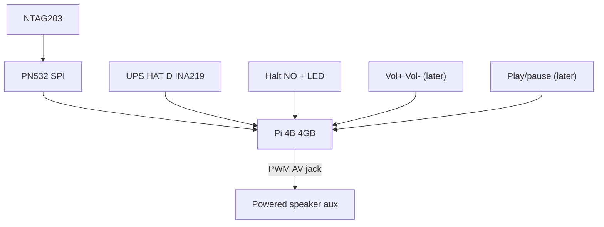

# Hardware BOM (birthday box)

Domain talks ports; this file is the `pi` profile. Software: [architecture.md](./architecture.md). Spec: [spec.md](./spec.md). Bring-up: [pi-setup.md](./pi-setup.md).

## Purchased / chosen

| Role | Part | Source |
|------|------|--------|
| Computer | Raspberry Pi 4 Model B **4GB** | [Pi Hut](https://thepihut.com/products/raspberry-pi-4-model-b?variant=20064052740158) |
| NFC reader | Waveshare **PN532 NFC HAT** | [Pi Hut](https://thepihut.com/products/nfc-hat-for-raspberry-pi-pn532) · [wiki](https://www.waveshare.com/wiki/PN532_NFC_HAT) |
| Figures | **NTAG203** clear tags (UID only) | [Pi Hut](https://thepihut.com/products/13-56mhz-rfid-nfc-clear-tag-ntag203-chip) |
| Halt + status | 16mm metal momentary, **blue LED ring** | [Pi Hut](https://thepihut.com/products/rugged-metal-pushbutton-with-blue-led-ring) |
| UPS | Waveshare **21700 UPS HAT (D)** (two 21700 cells, not included) | [Pi Hut](https://thepihut.com/products/21700-ups-hat-d-for-raspberry-pi-4-3) · [wiki](https://www.waveshare.com/wiki/UPS_HAT_(D)) |
| Volume + play | **Three more** 16mm momentaries (LED optional) — later; first box is halt only | same switch family |
| Audio | **Powered speaker with aux/amp jack** (household choice) | not the passive 4Ω pair as the amp |
| Storage | **16GB** microSD | user-supplied |

The [passive 3W 4Ω pair](https://thepihut.com/products/stereo-enclosed-speaker-set-3w-4-ohm) is an optional spare. **Do not** wire it to the AV jack without an amp.

## Required extras

| Why | Part |
|------|------|
| Pi 4 brown-out | USB-C **≥3A** PSU |
| First flash | HDMI or Imager SSH + house WPA |

## Interfaces

### PN532: SPI

- I0 = **L**, I1 = **H**; RSTPDN → **BCM 20**; DIP SCK/MISO/MOSI/NSS ON; SCL/SDA and RX/TX OFF. Mode latches on 5V.
- `PN532_SPI(reset=20, cs=4)` on SPI0. Enable `dtparam=spi=on`. UPS stays on I2C (`0x43`). The PN532 will **not** appear at `0x24` ([ADR-0009](./ADRs/0009-pn532-spi.md)).

### UPS HAT (D)

Pogo pins on the **underside** of the Pi. INA219 on i2c-1 address `0x43` (MCU also appears at `0x2D`). Charge on the dashboard is estimated from pack voltage: 3.0 V empty, 4.2 V full, clamped. Charge the pack through the HAT USB-C, not the Pi USB-C. `i2cdetect -y 1` should show **43** (and **2d**), not the PN532.

### Audio

Pi 4 analogue AV → powered speaker **aux/amp** input. Avoid I2S while RSTPDN is GPIO 20 ([ADR-0005](./ADRs/0005-pn532-spi-analogue-audio.md)).

### GPIO (BCM)

| Function | BCM | Board pin | Notes |
|----------|-----|-----------|--------|
| Halt (NO to pin, COM GND) | 17 | 11 | Short-press halt; `gpio-shutdown` wake |
| Status LED + | 27 | 13 | LED − to GND; 3.3V OK with built-in resistor |
| Volume down | 22 | 15 | Internal pull-up. Wired later; v1 volume is the dashboard |
| Volume up | 23 | 16 | Wired later |
| Play/pause | 24 | 18 | Wired later. Long-press (~0.8s) = restart |

## 16GB SD

| Partition | Size (approx) | Role |
|----------|---------------|------|
| `bootfs` | ~512MB | Firmware |
| `rootfs` | ~6GB | Overlay OS (on boxes that can be yanked) |
| `romini-data` | remainder | `/var/lib/romini` |

Dashboard shows free space. Full Library → fail closed. **No `nofail`** on the data mount once overlay is on.

## Enclosure

HAT coil under the **lid** (wood OK, metal not). Vent the Pi 4. Keep speaker magnets off the coil. First enclosure: one 16mm hole for halt + LED. Leave room for three more switches (vol±, play) later.

## Software mapping

| Port | `pi` adapter |
|------|----------------|
| NFC | PN532 SPI cs=4 rst=20, 250ms, UID hex |
| LED | GPIO 27 PWM |
| Vol ± | GPIO 22 / 23 (`apply_gpio_press`; not yet in `run_core_ticks`). First box: parent sets volume on the dashboard |
| Play/pause | GPIO 24 (same). First box: unused |
| Catalog import | Watch `catalog.yaml`, upsert mappings |
| Battery | UPS HAT (D) INA219 `0x43`; `sim` omits the reading |
| Player | mpv + ALSA analogue |
| Mixer | ALSA + ceiling |
| Halt | GPIO 17 + gpio-shutdown; `systemctl poweroff` |
