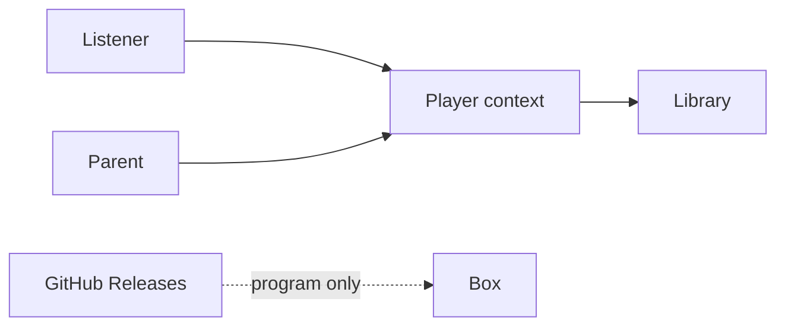

# Specification: RoMini player

Stakeholder spec after grilling 2026-09-13. Technical layout: [architecture.md](./architecture.md). Product: [PRD_001.md](./PRD_001.md).

## Bounded context

**Player** is the only bounded context in v1: Figures, Tags, Tracks, the Library, and Playback. The parent dashboard and GPIO are driving adapters on this context. GitHub Releases are outside: they update the program, never the Library.



## Glossary

| Term | Definition | Aggregate |
|------|-----------|-----------|
| Figure | Toy the child places or taps. Identity is the Tag. | — |
| Tag | NFC token; immutable UID. | TagMapping |
| Track | One audio file in the Library. | Library |
| Library | On-box collection of Tracks. | Library |
| PlaybackSession | Position in seconds for a UID. Track ends do not loop. | PlaybackSession |
| Play mode | `presence` or `tap`. Default `presence`. | settings |
| Assign mode | Parent is linking a Tag to a Track. Child play does not start. | — |
| Catalog | YAML file of Tracks and Tag UIDs on the data volume. Source of truth for mappings. | Library / TagMapping |

## Defaults

| Setting | Value |
|--------|--------|
| NFC poll | 250 ms |
| Presence grace | 2 s |
| Play start | within 500 ms of a mapped Tag |
| Cold boot to ready (LED + earcon) | within 20 s |
| Assign idle | 60 s then leave Assign mode |
| Restart Track | long-press play/pause (about 0.8 s) |
| Halt | short-press halt |
| Volume ceiling | software cap (percent until SPL is measured in the box) |
| Disk label | `romini-data` mounted at `/var/lib/romini` |

## Gherkin

```gherkin
Feature: Boot
  The box tells the household it is alive after power returns.

  Scenario: Power returns with no Figure
    Given the box had power yanked
    When power returns
    Then the status light animates
    And the box plays the Ready earcon
    And the box stays silent afterwards
    And the status light becomes steady

  Scenario: Power returns in presence with the same mapped Figure
    Given Play mode is presence
    And a mapped Figure is still on the box
    When power returns
    Then the box plays the Ready earcon
    And the box then resumes that Track from the last position
```

```gherkin
Feature: Presence play
  Default Play mode. The Figure stays on the box.

  Scenario: Mapped Figure starts the story
    Given Play mode is presence
    And Assign mode is off
    And a Figure is mapped to a Track
    When the listener places that Figure on the box
    Then the Track starts within 500 ms
    And the status light pulses

  Scenario: Unmapped Figure stays silent
    Given Play mode is presence
    And a Figure is not mapped
    When the listener places that Figure on the box
    Then the box does not play a Track

  Scenario: Lift pauses after grace
    Given Play mode is presence
    And a Track is playing
    When the listener lifts the Figure for more than 2 seconds
    Then the Track pauses
    And the box remembers the position for that Tag

  Scenario: Same Figure returns within grace
    Given Play mode is presence
    And a Track is playing
    When the listener lifts the Figure and puts the same Figure back within 2 seconds
    Then the Track continues without restarting

  Scenario: Different Figure during grace
    Given Play mode is presence
    And a Track is playing for Figure A
    When the listener places mapped Figure B
    Then the box stops Figure A's Track
    And the box starts Figure B's Track
```

```gherkin
Feature: Tap play
  The listener taps a Figure then uses buttons.

  Scenario: Tap selects the Track but does not require the Figure to stay
    Given Play mode is tap
    And Assign mode is off
    And a Figure is mapped to a Track
    When the listener taps that Figure
    Then the box selects that Track
    And the listener can start and pause with the play button
    And lifting the Figure does not pause the Track

  Scenario: Long-press play restarts the Track
    Given a Track is playing
    When the listener long-presses play
    Then the Track starts from the beginning
```

```gherkin
Feature: Transport and volume
  Physical buttons work in both Play modes.

  Scenario: Volume up never exceeds the ceiling
    Given the volume is at the ceiling
    When the listener presses volume up
    Then the loudness does not increase

  Scenario: Track ends
    Given a Track is playing
    When the Track reaches the end
    Then playback stops
    And the Track does not start again by itself

  Scenario: Play/pause in presence
    Given Play mode is presence
    And a mapped Figure is on the box
    And a Track is playing
    When the listener presses play
    Then the Track pauses until play is pressed again
```

```gherkin
Feature: Assign tag
  The parent links a Tag to a Track without SSH.

  Scenario: Assign does not start child audio
    Given the parent is in Assign mode
    When a mapped or unmapped Figure is on the box
    Then the box does not start a story Track
    And the parent can confirm the link
    And the catalog file lists that Tag and Track

  Scenario: Catalog row removed
    Given a Tag was mapped via the catalog
    When that UID is no longer in the catalog file
    And the box reads the catalog
    Then that Tag is unmapped
    And placing the Figure does not start a Track

  Scenario: Assign ends on idle
    Given the parent is in Assign mode
    When 60 seconds pass with no confirm
    Then Assign mode ends
    And child play rules apply again
```

```gherkin
Feature: Halt
  The household can sleep the box without yanking power.

  Scenario: Short-press halt
    Given the box is ready or playing
    When the listener short-presses halt
    Then the status light flashes
    And the box shuts down cleanly
    And if a Track was playing the position is remembered
```

```gherkin
Feature: Library
  Tracks live only on the box.

  Scenario: Parent adds a Track
    Given there is free space on the box
    When the parent adds an audio file on the house network
    Then the Track appears in the Library
    And the catalog file on the box lists that Track

  Scenario: Catalog file dropped on the box
    Given a catalog file names a Tag UID, a title, and an audio file that exists
    When the box reads the catalog
    Then that Tag is mapped to that Track
    And the listener can play it without using the dashboard

  Scenario: Catalog points at a missing audio file
    Given a catalog row names an audio file that is not on the box
    When the box reads the catalog
    Then that row is ignored
    And other mapped Tags still play

  Scenario: Disk full
    Given the Library has no free space
    When the parent adds an audio file
    Then the Track is not stored
    And the box says storage is full
```

## Cross-functional

| Quality | Criterion |
|---------|-----------|
| Accessibility | Parent dashboard on a laptop/phone browser; no child screen. Unknown WCAG target — treat as simple large controls. |
| Security / privacy | House WPA Wi-Fi. No HTTP PIN. Playback needs no internet. PAT stays on the box, never in git. Sim-only injectors off on the box. |
| Performance | Play start 500 ms; boot 20 s; NFC poll 250 ms. Device measurements, not CI load tests. |
| Browser | Parent: add Track, assign Tag, switch Play mode, see free space. |

## Behaviour catalog notes

No tests exist yet. Design should **add** unit/slice cases for every scenario above (`presence` and `tap`). Browser E2E for dashboard only. No cases to keep or retire.

`play_mode` is a **setting**, not a kill flag. Catalog both values. There is no “operator kills NFC” path.

## Bet / flag

| Field | Value |
|-------|--------|
| Kind | **Contract** |
| Leading indicator | n/a |
| Flag | `play_mode` default `presence`; not a kill switch; no expiry |

## Technical constraints

- Player aggregates and ports as in [architecture.md](./architecture.md).
- SQLite WAL: playback position, volume, `play_mode`, and a **cache** of the catalog. Catalog YAML is source of truth for Tag → Track ([library-catalog.md](./library-catalog.md), [ADR-0007](./ADRs/0007-yaml-catalog-sqlite-session.md)).
- Paths relative to the data volume Library directory.
- `pi` GPIOs: halt 17, LED 27, vol− 22, vol+ 23, play/pause 24 ([hardware.md](./hardware.md)).
- Overlay + `romini-data` before any box can be yanked; bench may stay read-write.
- Ready earcon ships **in the wheel**, not in `catalog.yaml`.
