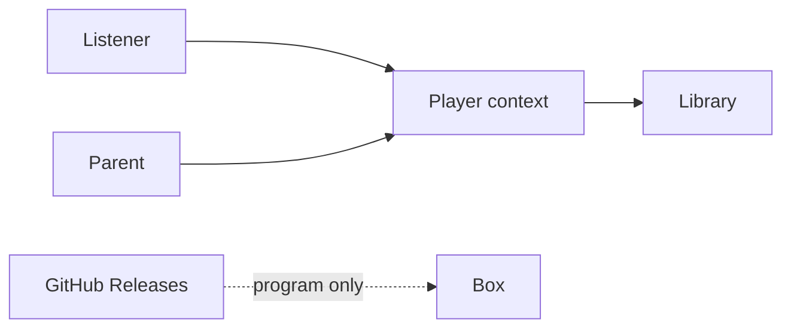

# Specification: RoMini player

Stakeholder spec after grilling 2026-09-13. How to run: [guide.md](./guide.md). Technical layout: [architecture.md](./architecture.md). Product: [PRD_001.md](./PRD_001.md).

## Bounded context

**Player** is the only bounded context in v1: Figures, Tags, Tracks, the Library, and Playback. The parent dashboard and GPIO are driving adapters on this context. GitHub Releases are outside: they update the program, never the Library.



## Glossary

| Term | Definition | Aggregate |
|------|-----------|-----------|
| Figure | Toy the child places or taps. Identity is the Tag. | — |
| Tag | NFC token; immutable UID. | TagMapping |
| Track | One audio file in the Library. | Library |
| Library | On-box collection of Tracks. | Library |
| PlaybackSession | Position in seconds for a UID. Track ends do not loop. | PlaybackSession |
| Play mode | `presence` or `tap`. Default `presence`. | settings |
| Assign mode | Parent is linking a Tag to a Track. Child play does not start. | — |
| Register mode | Parent is collecting Tag UIDs into the catalog. Same mute as Assign mode. | — |
| Catalog | YAML file of Tracks, registered Tags, and Tag UIDs on the data volume. Source of truth for mappings. | Library / TagMapping |
| Story pack | Parent-authored bedtime story: title, selected character slugs, points to cover, outline, extra files, current script, spoken Track. Lives with the Library on the data volume. Not a Player aggregate. | Story pack |
| Character | Reusable person with a name and background/history. Lives on the data volume. Stories pick characters with checkboxes. | Character |
| Audit log | Newest-first list of box changes. Keys never appear. Last 1000 events stay on the data volume. | — |

## Defaults

| Setting | Value |
|--------|--------|
| NFC poll | 250 ms with a figure or Assign; 2 s when the lid is empty, reader asleep between polls |
| Shelf halt | 10 min with no figure and no playback, then power off |
| Presence grace | 2 s |
| Play start | within 500 ms of a mapped Tag |
| Cold boot to ready (LED + earcon) | within 20 s |
| Assign idle | 60 s then leave Assign mode |
| Restart Track | long-press play/pause (about 0.8 s) |
| Halt | short-press halt |
| Volume ceiling | software cap (percent until SPL is measured in the box) |
| Disk label | `romini-data` mounted at `/var/lib/romini` |

## Gherkin

```gherkin
Feature: Boot
  The box tells the household it is alive after power returns.

  Scenario: Power returns with no Figure
    Given the box had power yanked
    When power returns
    Then the status light animates
    And the box plays the Ready earcon
    And the box stays silent afterwards
    And the status light becomes steady

  Scenario: Power returns in presence with the same mapped Figure
    Given Play mode is presence
    And a mapped Figure is still on the box
    When power returns
    Then the box plays the Ready earcon
    And the box then resumes that Track from the last position
```

```gherkin
Feature: Presence play
  Default Play mode. The Figure stays on the box.

  Scenario: Mapped Figure starts the story
    Given Play mode is presence
    And Assign mode is off
    And a Figure is mapped to a Track
    When the listener places that Figure on the box
    Then the Track starts within 500 ms
    And the status light pulses

  Scenario: Unmapped Figure stays silent
    Given Play mode is presence
    And a Figure is not mapped
    When the listener places that Figure on the box
    Then the box does not play a Track

  Scenario: Lift pauses after grace
    Given Play mode is presence
    And a Track is playing
    When the listener lifts the Figure for more than 2 seconds
    Then the Track pauses
    And the box remembers the position for that Tag

  Scenario: Same Figure returns within grace
    Given Play mode is presence
    And a Track is playing
    When the listener lifts the Figure and puts the same Figure back within 2 seconds
    Then the Track continues without restarting

  Scenario: Different Figure during grace
    Given Play mode is presence
    And a Track is playing for Figure A
    When the listener places mapped Figure B
    Then the box stops Figure A's Track
    And the box starts Figure B's Track
```

```gherkin
Feature: Tap play
  The listener taps a Figure to start a story. The story plays to the end unless they tap the same Figure again.

  Scenario: Tap starts the Track and does not require the Figure to stay
    Given Play mode is tap
    And Assign mode is off
    And a Figure is mapped to a Track
    When the listener taps that Figure
    Then the box starts that Track
    And lifting the Figure does not pause the Track

  Scenario: Same Figure tap pauses playback
    Given Play mode is tap
    And a Track is playing for Figure A
    When the listener taps Figure A again
    Then the box pauses that Track

  Scenario: Long-press play restarts the Track
    Given a Track is playing
    When the listener long-presses play
    Then the Track starts from the beginning
```

```gherkin
Feature: Transport and volume
  Physical buttons work in both Play modes. The first box has halt only; the parent sets volume on the dashboard.

  Scenario: Volume up never exceeds the ceiling
    Given the volume is at the ceiling
    When the listener presses volume up
    Then the loudness does not increase

  Scenario: Parent sets volume on the dashboard
    Given the box has a power button only
    When the parent sets the volume on the dashboard
    Then the box stores that level
    And the level stays at or below the software ceiling
```

  Scenario: Track ends
    Given a Track is playing
    When the Track reaches the end
    Then playback stops
    And the Track does not start again by itself

  Scenario: Play/pause in presence
    Given Play mode is presence
    And a mapped Figure is on the box
    And a Track is playing
    When the listener presses play
    Then the Track pauses until play is pressed again
```

```gherkin
Feature: Assign tag
  The parent links a Tag to a Track without SSH.

  Scenario: Assign does not start child audio
    Given the parent is in Assign mode
    When a mapped or unmapped Figure is on the box
    Then the box does not start a story Track
    And the parent can confirm the link
    And the catalog file lists that Tag and Track

  Scenario: Catalog row removed
    Given a Tag was mapped via the catalog
    When that UID is no longer in the catalog file
    And the box reads the catalog
    Then that Tag is unmapped
    And placing the Figure does not start a Track

  Scenario: Assign ends on idle
    Given the parent is in Assign mode
    When 60 seconds pass with no confirm
    Then Assign mode ends
    And child play rules apply again
```

```gherkin
Feature: Register figures
  The parent teaches the box which Tags exist, then names them, then maps a Tag to a Track.

  Scenario: Register persists a new Tag
    Given the parent is in Register mode
    When the parent places a Figure on the box
    Then the catalog lists that Tag UID
    And the box does not start a story Track
    And the status light blinks
    And the box plays the connect earcon

  Scenario: Register keeps an existing name
    Given the parent is in Register mode
    And that Tag already has a name
    When the parent places the same Figure
    Then the catalog still has one row for that Tag
    And the name is unchanged

  Scenario: Parent names a registered Tag
    Given a Tag UID is listed in the catalog
    When the parent saves a name for that Tag
    Then the catalog stores that name with the UID

  Scenario: Assign picks a registered Tag
    Given registered Tags are listed in the catalog
    When the parent assigns a Tag to a Track
    Then the catalog maps that Tag UID to the Track
```

```gherkin
Feature: Charge on the parent dashboard
  The box is on a Waveshare 21700 UPS HAT (D). Remaining charge is estimated from pack voltage.

  Scenario: Parent sees remaining charge
    Given the UPS HAT is on the I2C bus
    When the parent opens the dashboard
    Then the masthead shows remaining charge as a percent

  Scenario: Laptop sim has no HAT
    Given the dashboard is running without the UPS HAT
    When the parent opens the dashboard
    Then remaining charge is omitted
```

```gherkin
Feature: Halt
  The household can sleep the box without yanking power.

  Scenario: Short-press halt
    Given the box is ready or playing
    When the listener short-presses halt
    Then the status light flashes
    And the box shuts down cleanly
    And if a Track was playing the position is remembered
```

```gherkin
Feature: Library
  Tracks live only on the box.

  Scenario: Parent adds a Track
    Given there is free space on the box
    When the parent adds an audio file on the house network
    Then the Track appears in the Library
    And the catalog file on the box lists that Track

  Scenario: Catalog file dropped on the box
    Given a catalog file names a Tag UID, a title, and an audio file that exists
    When the box reads the catalog
    Then that Tag is mapped to that Track
    And the listener can play it without using the dashboard

  Scenario: Catalog points at a missing audio file
    Given a catalog row names an audio file that is not on the box
    When the box reads the catalog
    Then that row is ignored
    And other mapped Tags still play

  Scenario: Disk full
    Given the Library has no free space
    When the parent adds an audio file
    Then the Track is not stored
    And the box says storage is full
```

```gherkin
Feature: Characters on the parent dashboard
  A parent keeps reusable people with background and history.
  Stories pick who is in the tale. Player does not learn characters.

  Scenario: Character fields are on their own page
    Given the parent opens the dashboard
    When they open Characters
    Then they see labelled fields for Name and Background and history

  Scenario: A character stays on the box
    Given the parent is on Characters
    When they save a name and background
    Then that character is still listed when they open Characters again

  Scenario: Stories pick characters
    Given the parent has saved a character
    When they write a story
    Then they see a checkbox for that character
    And they do not type characters as free text on the story
```

```gherkin
Feature: Story notes on the parent dashboard
  A parent keeps points to cover and an outline on a bedtime story.
  Characters live on the Characters page. Gemini and narration are other stories. Player does not learn notes.

  Scenario: Note fields are on the dashboard
    Given the parent opens the dashboard
    When they start a story
    Then they see labelled fields for Points to cover / interests and Story outline
    And they pick characters with checkboxes

  Scenario: Notes stay on the story
    Given the parent has started a story
    When they save selected characters, Points to cover / interests, and Story outline
    Then those documents are still on that story when they open it again

  Scenario: Blank notes still save
    Given the parent has started a story
    When they leave a note empty and save
    Then the story is still saved
    And they can type a script later

  Scenario: Extra files stay on the story
    Given the parent has started a story
    When they attach an extra file and save
    Then the file is listed on that story
    And they can remove it without deleting the spoken Track
```

```gherkin
Feature: Story studio keys, draft, and speak
  A parent drafts and speaks on the house LAN. Playback stays offline.
  Player does not learn Gemini or ElevenLabs.

  Scenario: Keys are set not shown
    Given the parent types Gemini and ElevenLabs keys on the dashboard
    When they save
    Then the page says which keys are set
    And it does not show the secret

  Scenario: Draft fills an editable script
    Given Gemini is configured
    And the open story has notes
    When the parent asks for a draft
    Then they see a script in an editable box that used those notes
    And narration has not started

  Scenario: Draft cannot run
    Given Gemini is missing or the house is offline
    When the parent asks for a draft
    Then they see that the script could not be written
    And they can still type a script

  Scenario: Speak stores a Track
    Given ElevenLabs is configured
    And the open story has a script the parent can see
    When the parent asks the dashboard to speak it
    Then an MP3 is stored on that story and in the library file list
    And they can assign it with Assign a figure

  Scenario: Speak again replaces the spoken file
    Given a story already has a spoken Track
    When the parent changes the script and speaks again
    Then the story's spoken file is the new MP3
    And a figure already assigned to that Track still plays it

  Scenario: Speak cannot run
    Given the key is missing or ElevenLabs is down
    When the parent asks the dashboard to speak
    Then they see that the story could not be spoken
    And the previous spoken file stays
    And upload still works

  Scenario: Reopen a saved story
    Given two stories are saved on the box
    When the parent opens the second
    Then they see that story's notes, script, extra files, and spoken file
    And not the first story's
```

```gherkin
Feature: Audit log
  The parent can see what the box has done.

  Scenario: Settings lists what happened
    Given the box stored a Track
    And a Figure started that Track
    When the parent opens Settings
    Then the Audit log lists those events newest first

  Scenario: Quiet box
    Given nothing has happened since the box was set up
    When the parent opens Settings
    Then the Audit log says nothing has happened yet

  Scenario: Keys stay private
    Given the parent saved studio keys
    When the parent opens Settings
    Then the Audit log does not show the key values
```

## Cross-functional

| Quality | Criterion |
|---------|-----------|
| Accessibility | Parent dashboard on a laptop/phone browser; no child screen. Unknown WCAG target — treat as simple large controls. |
| Security / privacy | House WPA Wi-Fi. No HTTP PIN. Playback needs no internet. PAT stays on the box, never in git. Sim-only injectors off on the box. |
| Performance | Play start 500 ms; boot 20 s; NFC poll 250 ms. Device measurements, not CI load tests. |
| Browser | Parent: add Track, register Tag, name Tag, assign Tag, switch Play mode, set volume, see free space and charge, write story notes, save studio keys, draft a script, speak a script, reopen a saved story, read the Audit log on Settings. |

## Behaviour catalog notes

No tests exist yet. Design should **add** unit/slice cases for every scenario above (`presence` and `tap`). Browser E2E for dashboard only. No cases to keep or retire.

`play_mode` is a **setting**, not a kill flag. Catalog both values. There is no “operator kills NFC” path.

## Bet / flag

| Field | Value |
|-------|--------|
| Kind | **Contract** |
| Leading indicator | n/a |
| Flag | `play_mode` default `presence`; not a kill switch; no expiry |

## Technical constraints

- Player aggregates and ports as in [architecture.md](./architecture.md).
- SQLite WAL: playback position, volume, `play_mode`, and a **cache** of the catalog. Catalog YAML is source of truth for Tag → Track ([library-catalog.md](./library-catalog.md), [ADR-0007](./ADRs/0007-yaml-catalog-sqlite-session.md)).
- Paths relative to the data volume Library directory.
- `pi` GPIOs: halt 17, LED 27; vol− 22, vol+ 23, play/pause 24 are specified for later buttons ([hardware.md](./hardware.md)). First iteration: halt only; volume is set on the dashboard.
- Overlay + `romini-data` before any box can be yanked; bench may stay read-write.
- Ready earcon ships **in the wheel**, not in `catalog.yaml`.
